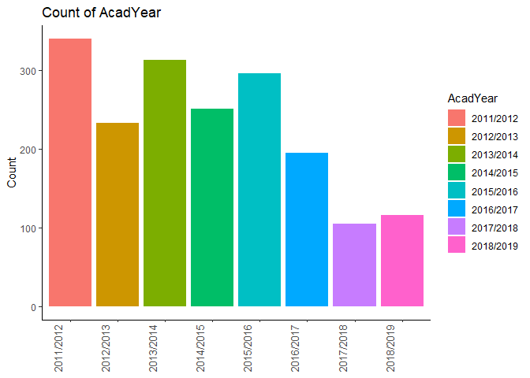
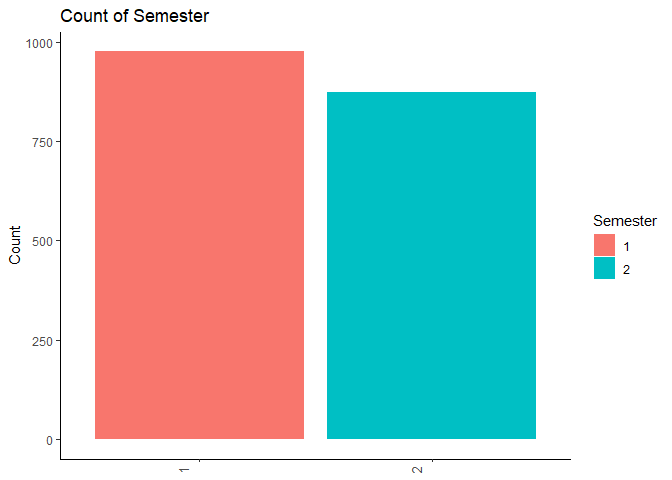
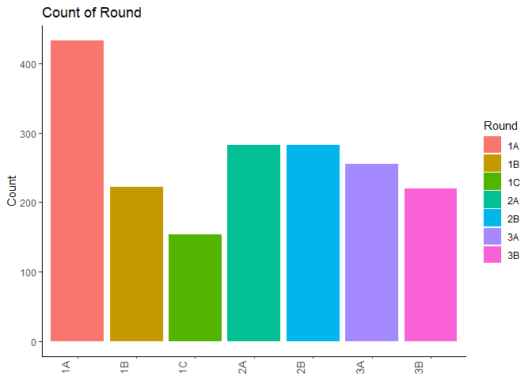
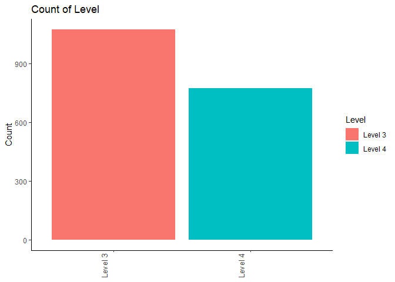
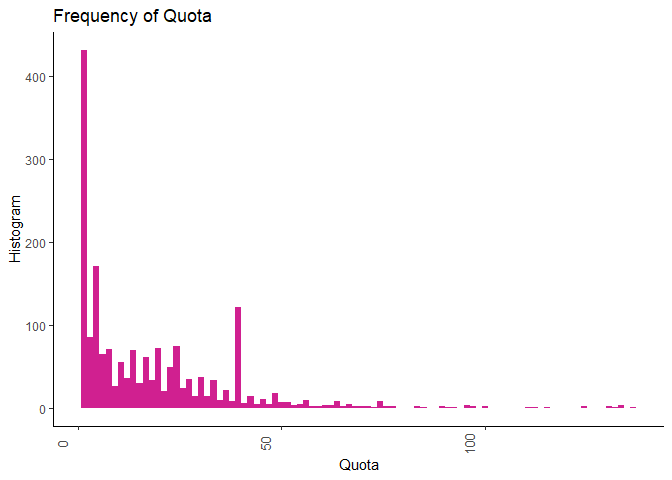
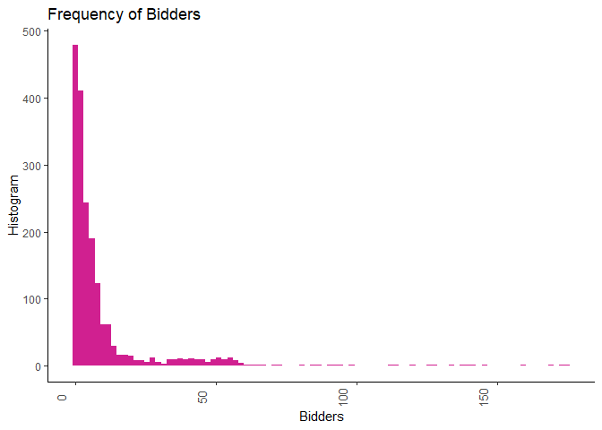
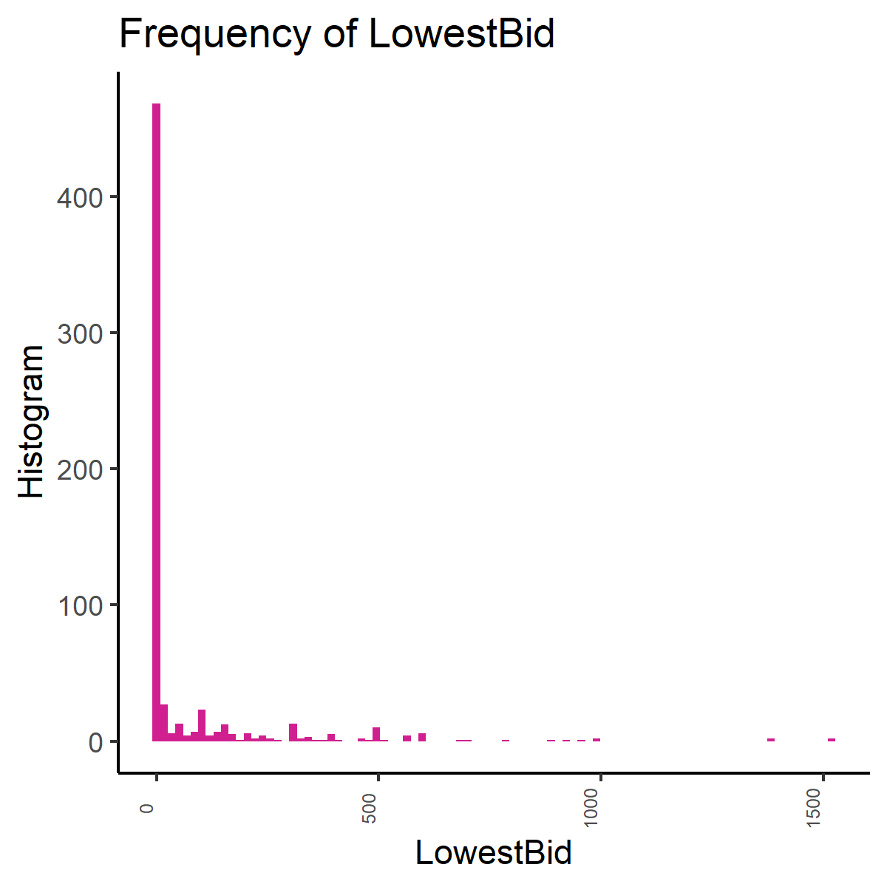
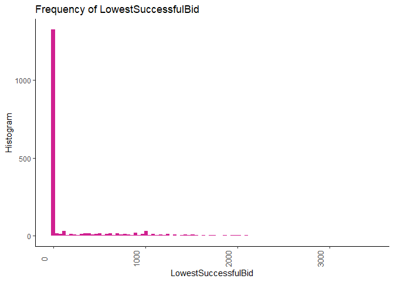
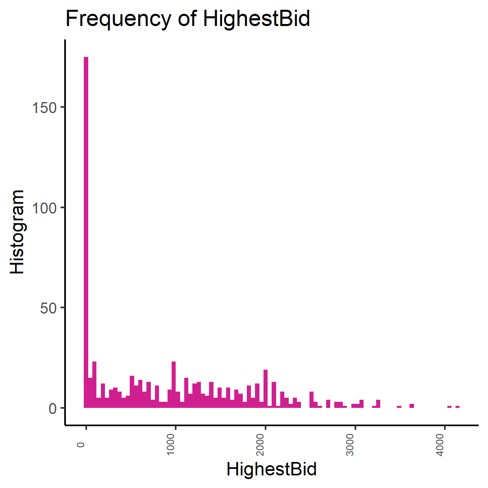
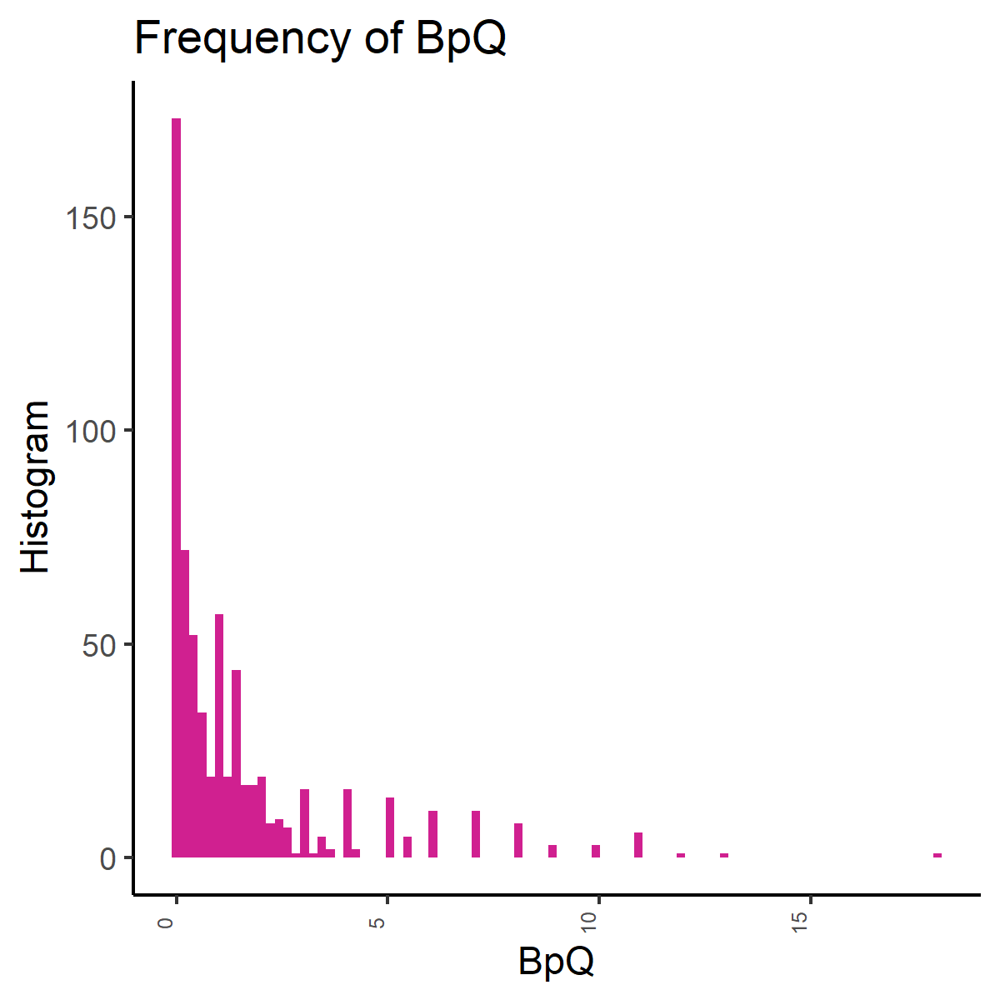

NUSmodAn
================
Aaron0696

  - [Set Up](#set-up)
  - [Extract Data](#extract-data)
      - [Bidding Data From `nusmods`](#bidding-data-from-nusmods)
      - [Load `mydata.RDS`](#load-mydata.rds)
      - [Module Information](#module-information)
      - [Load `myModInfo.RDS`](#load-mymodinfo.rds)
  - [Transform Data](#transform-data)
  - [Explore Data](#explore-data)
      - [Univariate Descriptive
        Statistics](#univariate-descriptive-statistics)
      - [Univariate Histograms](#univariate-histograms)
      - [Bivariate Plots](#bivariate-plots)
  - [Is It Easier To Bid For Modules With Extremely Early/Late
    Lectures?](#is-it-easier-to-bid-for-modules-with-extremely-earlylate-lectures)

# Set Up

``` r
library(semTools)
library(ggplot2)
library(rjson)
library(stringr)
library(DT)
library(psych)
library(corrplot)
library(dplyr)
options(width = 999)
```

# Extract Data

## Bidding Data From `nusmods`

``` r
# load bidding data
# calculate loading times
before <- Sys.time()
# read data directly from URL
myjson <- fromJSON(file = url("https://api.nusmods.com/corsBiddingStatsRaw.json"))
# create empty dataframe which will act as a container to be populated with data
mydata <- data.frame()
# for each element in the myjson list, append it to mydata
for(r in 1:length(myjson))
{
  if(myjson[[r]]$Semester == 1 | myjson[[r]]$Semester == 2)
  {
    mydata <- rbind(mydata, myjson[[r]])
  }
  myjson[[r]] <- NA
}
# calculate loading time
after <- Sys.time()
after - before
# remove myjson to free up some RAM
rm(myjson)
# peek at the data
head(mydata)
tail(mydata)
# data struct
str(mydata)
# save
saveRDS(mydata, file = "mydata.RDS")
```

## Load `mydata.RDS`

``` r
mydata <- readRDS("mydata.RDS")
```

## Module Information

``` r
myjson <- fromJSON(file = url("https://nusmods.com/api/moduleTimetableDeltaRaw.json"))
# create empty dataframe which will act as a container to be populated with data
myModInfo <- data.frame()
# for each element in the myjson list, append it to mydata
for(r in 1:length(myjson))
{
  if(myjson[[r]]$Semester == 1 | myjson[[r]]$Semester == 2)
  {
    myModInfo <- rbind(myModInfo, myjson[[r]])
  }
  myjson[[r]] <- NA
}

# save
saveRDS(myModInfo, file = "myModInfo.RDS")
```

## Load `myModInfo.RDS`

``` r
mydata <- readRDS("mydata.RDS")
```

# Transform Data

``` r
# remove unneeded columns
mydata <- mydata[, -grep("Group|StudentAcctType|Faculty", names(mydata))]
# remove non-psychology modules
mydata <- subset(mydata,
                 # only keep rows where module code begins with PL
                 str_detect(mydata$ModuleCode, "^PL"))
# remove core psychology modules, they are PL323[2 to 6], PL1101E, PL2131, PL2132.
# also remove Roots and Wings (PLS8001) and psychology for non-psych students (PLB1201)
mydata <- subset(mydata,
                 !str_detect(mydata$ModuleCode, "PL323[2-6]|PL1101|PL2131|PL2132|PLS|PLB"))

# create new column that indicates the level of the module, based on their module code
# since I removed all the level 1 and level 2 modules in the lines above, technically I dont require the first two
# ifelse conditions, but I'll leave it here as a demonstration.
mydata$Level <- ifelse(str_detect(mydata$ModuleCode, "1[0-9][0-9][0-9]"), "Level 1",
                       ifelse(str_detect(mydata$ModuleCode, "2[0-9][0-9][0-9]"), "Level 2",
                              ifelse(str_detect(mydata$ModuleCode, "3[0-9][0-9][0-9]"), "Level 3",
                                     ifelse(str_detect(mydata$ModuleCode, "4[0-9][0-9][0-9]"), "Level 4", 
                                            "Graduate Module"))))
# crosstabs to doublecheck
xtabs( ~ ModuleCode + Level, 
       data = mydata, subset = NULL)
```

    ##           Level
    ## ModuleCode Level 3 Level 4
    ##    PL3237       55       0
    ##    PL3238       36       0
    ##    PL3239       48       0
    ##    PL3240       45       0
    ##    PL3241       64       0
    ##    PL3242       59       0
    ##    PL3243       24       0
    ##    PL3244       33       0
    ##    PL3248       35       0
    ##    PL3249       32       0
    ##    PL3250       31       0
    ##    PL3251       19       0
    ##    PL3252       33       0
    ##    PL3253       12       0
    ##    PL3254       39       0
    ##    PL3255       31       0
    ##    PL3256       18       0
    ##    PL3257       21       0
    ##    PL3258       23       0
    ##    PL3259       16       0
    ##    PL3260        5       0
    ##    PL3261       19       0
    ##    PL3281       40       0
    ##    PL3281A      51       0
    ##    PL3281B      10       0
    ##    PL3281C      18       0
    ##    PL3281D      40       0
    ##    PL3282       27       0
    ##    PL3282A      13       0
    ##    PL3282C       6       0
    ##    PL3283        5       0
    ##    PL3283A       6       0
    ##    PL3283B      29       0
    ##    PL3284       44       0
    ##    PL3285        6       0
    ##    PL3286       37       0
    ##    PL3287       21       0
    ##    PL3288       22       0
    ##    PL3289        1       0
    ##    PL4201        0      28
    ##    PL4202        0      32
    ##    PL4203        0      45
    ##    PL4205        0      30
    ##    PL4206        0      43
    ##    PL4207        0      20
    ##    PL4208        0      13
    ##    PL4213        0      22
    ##    PL4214        0      21
    ##    PL4217        0      13
    ##    PL4218        0      23
    ##    PL4219        0      25
    ##    PL4220        0      12
    ##    PL4221        0      44
    ##    PL4222        0      37
    ##    PL4223        0      14
    ##    PL4224        0      17
    ##    PL4225        0       4
    ##    PL4226        0      18
    ##    PL4227        0      24
    ##    PL4228        0      17
    ##    PL4229        0      20
    ##    PL4230        0       7
    ##    PL4231        0      17
    ##    PL4232        0       5
    ##    PL4233        0       3
    ##    PL4234        0      22
    ##    PL4235        0      26
    ##    PL4237        0      29
    ##    PL4238        0      11
    ##    PL4239        0       2
    ##    PL4240        0       4
    ##    PL4241        0       5
    ##    PL4880F       0      16
    ##    PL4880G       0      17
    ##    PL4880H       0       8
    ##    PL4880I       0       6
    ##    PL4880J       0      18
    ##    PL4880K       0       8
    ##    PL4880L       0      19
    ##    PL4880N       0       4
    ##    PL4880P       0       7
    ##    PL4880Q       0       4
    ##    PL4880R       0      15

``` r
# transform these columns to numeric
for(r in c("Quota", "Bidders", "LowestBid", "LowestSuccessfulBid", "HighestBid"))
{
  mydata[,grep(r, names(mydata))] <- as.numeric(mydata[,grep(r, names(mydata))])
}
# transform these columns to factors
for(r in c("AcadYear", "Semester", "ModuleCode", "Round", "Level"))
{
  mydata[,grep(r, names(mydata))] <- factor(mydata[,grep(r, names(mydata))])
}
# create new column Bids Per Quota (BpQ)
mydata$BpQ <- with(mydata, Bidders/Quota)
# datatable *htmlwidget
# datatable(mydata, filter = "top", width = 600)
```

# Explore Data

## Univariate Descriptive Statistics

``` r
describe(mydata)
```

    ##                     vars    n   mean     sd median trimmed    mad min  max range skew kurtosis    se
    ## AcadYear*              1 1849   3.82   2.10   4.00    3.70   2.97   1    8     7 0.30    -0.89  0.05
    ## Semester*              2 1849   1.47   0.50   1.00    1.47   0.00   1    2     1 0.11    -1.99  0.01
    ## Round*                 3 1849   3.76   2.10   4.00    3.70   2.97   1    7     6 0.03    -1.36  0.05
    ## ModuleCode*            4 1849  33.29  23.09  33.00   32.00  29.65   1   83    82 0.32    -1.03  0.54
    ## Quota                  5 1849  18.25  20.23  12.00   14.90  14.83   1  136   135 2.10     6.66  0.47
    ## Bidders                6 1849   8.87  18.54   3.00    4.29   4.45   0  175   175 4.46    26.26  0.43
    ## LowestBid              7 1849  79.48 237.76   1.00   16.94   1.48   0 2430  2430 4.76    28.77  5.53
    ## LowestSuccessfulBid    8 1849 263.96 549.67   1.00  122.91   1.48   0 3459  3459 2.42     5.91 12.78
    ## HighestBid             9 1849 713.25 901.23 219.00  559.86 324.69   0 4801  4801 1.23     0.78 20.96
    ## Level*                10 1849   1.42   0.49   1.00    1.40   0.00   1    2     1 0.33    -1.89  0.01
    ## BpQ                   11 1849   1.01   1.74   0.29    0.60   0.42   0   15    15 3.27    13.70  0.04

``` r
summary(mydata)
```

    ##       AcadYear   Semester Round      ModuleCode       Quota           Bidders          LowestBid       LowestSuccessfulBid   HighestBid         Level           BpQ         
    ##  2011/2012:340   1:975    1A:433   PL3241 :  64   Min.   :  1.00   Min.   :  0.000   Min.   :   0.00   Min.   :   0        Min.   :   0.0   Level 3:1074   Min.   : 0.0000  
    ##  2013/2014:313   2:874    1B:222   PL3242 :  59   1st Qu.:  3.00   1st Qu.:  0.000   1st Qu.:   0.00   1st Qu.:   0        1st Qu.:   0.0   Level 4: 775   1st Qu.: 0.0000  
    ##  2015/2016:296            1C:154   PL3237 :  55   Median : 12.00   Median :  3.000   Median :   1.00   Median :   1        Median : 219.0                  Median : 0.2857  
    ##  2014/2015:251            2A:282   PL3281A:  51   Mean   : 18.25   Mean   :  8.872   Mean   :  79.48   Mean   : 264        Mean   : 713.3                  Mean   : 1.0066  
    ##  2012/2013:233            2B:283   PL3239 :  48   3rd Qu.: 27.00   3rd Qu.:  8.000   3rd Qu.:   7.00   3rd Qu.: 153        3rd Qu.:1234.0                  3rd Qu.: 1.2250  
    ##  2016/2017:195            3A:255   PL3240 :  45   Max.   :136.00   Max.   :175.000   Max.   :2430.00   Max.   :3459        Max.   :4801.0                  Max.   :15.0000  
    ##  (Other)  :221            3B:220   (Other):1527

## Univariate Histograms

<details>

<summary>View Histograms</summary>

``` r
# plot the categorical variables
# note: I did not include ModuleCode in this exploratory graph because it has too many levels (83)
for(r in c("AcadYear", "Semester", "Round", "Level"))
{
  cat(paste0("Histogram Of ", r))
  
  plot(
    ggplot(data = mydata, aes_string(x = r, fill = r)) + 
  geom_histogram(stat = "count") + 
  ylab("Count") +
  ggtitle(paste0("Count of ", r)) +
  theme_classic() + 
  theme(axis.text.x = element_text(angle = 90, size = 10, vjust = -1),
        axis.title.x = element_blank())
  )
}
```

    ## Histogram Of AcadYear

<!-- -->

    ## Histogram Of Semester

<!-- -->

    ## Histogram Of Round

<!-- -->

    ## Histogram Of Level

<!-- -->

``` r
# plot the continuous variables
for(r in c("Quota", "Bidders", "LowestBid", "LowestSuccessfulBid", "HighestBid", "BpQ"))
{
  cat(paste0("Histogram Of ", r))
  
  plot(
    ggplot(data = mydata, aes_string(x = r, fill = r)) + 
  geom_histogram(bins = 90, fill = "violetred") + 
  ylab("Histogram") +
  ggtitle(paste0("Frequency of ", r)) +
  theme_classic() + 
  theme(axis.text.x = element_text(angle = 90, size = 10, vjust = -1),
        axis.title.x = element_text())
  )
}
```

    ## Histogram Of Quota

<!-- -->

    ## Histogram Of Bidders

<!-- -->

    ## Histogram Of LowestBid

<!-- -->

    ## Histogram Of LowestSuccessfulBid

<!-- -->

    ## Histogram Of HighestBid

<!-- -->

    ## Histogram Of BpQ

<!-- -->

</details>

## Bivariate Plots

<details>

<summary>View Categorical-Categorical Bivariate Plots</summary>

### Categorical-Categorical

``` r
# create vector to loop across
looper <- c("AcadYear", "Semester", "Round", "Level")
for(r in 1:length(looper))
{
  for(i in 1:length(looper))
  {
   # dont do anything if they are the same or the graph has been made before
   if(i == r | i < r)
   {
   } else {
     cat(paste0(looper[r]," ~ ",looper[i]))
     
     # create formula for xtabs
     tempform <- paste0("~ ", looper[r], " + ", looper[i])
     # temp is a dataframe that is only going to exist in this section
     # and overwritten with each loop
     temp <- as.data.frame(xtabs(eval(parse(text = tempform)),
                            data = mydata,
                            subset = NULL))
     plot(
       ggplot(data = temp, aes_string(x = looper[r], y = looper[i], fill = "Freq", label = "Freq")) +
         geom_tile() + 
         geom_text() + 
         scale_fill_gradient(low = "white", high = "violetred") + 
         theme_minimal() + 
         theme(axis.text.x = element_text(angle = 90, size = 10, vjust = -1))
     )
   }
  }
}
```

</details>

<details>

<summary>View Continuous-Continuous Bivariate Plots</summary>

### Continuous-Continuous

``` r
# create vector to loop across
looper <- c("Quota", "Bidders", "LowestBid", "LowestSuccessfulBid", "HighestBid", "BpQ")
for(r in 1:length(looper))
{
  for(i in 1:length(looper))
  {
   # dont do anything if they are the same or the graph has been made before
   if(i == r | i < r)
   {
   } else {
     cat(paste0(looper[r]," ~ ",looper[i]))
     # create formula for lm()
     tempform.std <- paste0("scale(", looper[i],")", " ~ ", "scale(", looper[r], ")")
     tempform <- paste0(looper[i], " ~ ", looper[r])
     # regress to get best fit line
     # standardized
     stdreg <- lm(eval(parse(text = tempform.std)),
               data = mydata)
     # unstandardized
     reg <- lm(eval(parse(text = tempform)),
               data = mydata)
     
     plot(
       ggplot(data = mydata, aes_string(x = looper[r], y = looper[i])) +
         geom_point(color = "violetred", size = 2, alpha = 0.5) +
         theme_classic() + 
         geom_abline(slope = reg$coefficients[2], intercept = reg$coefficients[1], lty = "dashed") + 
         geom_label(aes(x = Inf, y = Inf, label = paste0("Standardized Regression Coefficient = ",
                                                         round(stdreg$coefficients[2],3)),
                        hjust = 1, vjust = 1)) + 
         theme(axis.text.x = element_text(angle = 90, size = 10, vjust = -1))
     )
   }
  }
}
```

</details>

<details>

<summary>View Correlation Matrix</summary>

### Correlation Matrix

``` r
corrplot.mixed(cor(select_if(mydata, is.numeric)),
               upper = "color",
               tl.pos = "lt")
```

<!-- -->

<details>

<summary>View Continuous-Categorical Bivariate Plots</summary>

### Continuous-Categorical

``` r
for(r in c("AcadYear", "Semester", "Round", "Level"))
{
  for(i in c("Quota", "Bidders", "LowestBid", "LowestSuccessfulBid", "HighestBid", "BpQ"))
  {
    cat(paste0(r," ~ ",i))
    # graph
    plot(
      ggplot(data = mydata, aes_string(x = r, y = i, fill = r)) + 
      geom_bar(stat = "identity") + 
      theme_classic() + 
      theme(legend.position = "none",
            axis.text.x = element_text(angle = 90, size = 10, vjust = -1))
    )
  }
}
```

</details>

<details>

<summary>View Continuous-Module Bivariate Plots</summary>

### By Module

``` r
for(i in c("Quota", "Bidders", "LowestBid", "LowestSuccessfulBid", "HighestBid", "BpQ"))
{
  cat(paste0("ModuleCode"," ~ ",i))
  # graph
  plot(
    ggplot(data = mydata, aes_string(x = "ModuleCode", y = i, fill = "ModuleCode")) + 
      geom_bar(stat = "identity") + 
      theme_classic() + 
      theme(legend.position = "none",
            axis.text.x = element_text(angle = 90, size = 10, vjust = -1)) + 
      coord_flip()
  )
}
```

</details>

# Is It Easier To Bid For Modules With Extremely Early/Late Lectures?

``` r
# testing
lm(BpQ ~ Level,
   data = mydata)
```

    ## 
    ## Call:
    ## lm(formula = BpQ ~ Level, data = mydata)
    ## 
    ## Coefficients:
    ##  (Intercept)  LevelLevel 4  
    ##       0.6064        0.9546
