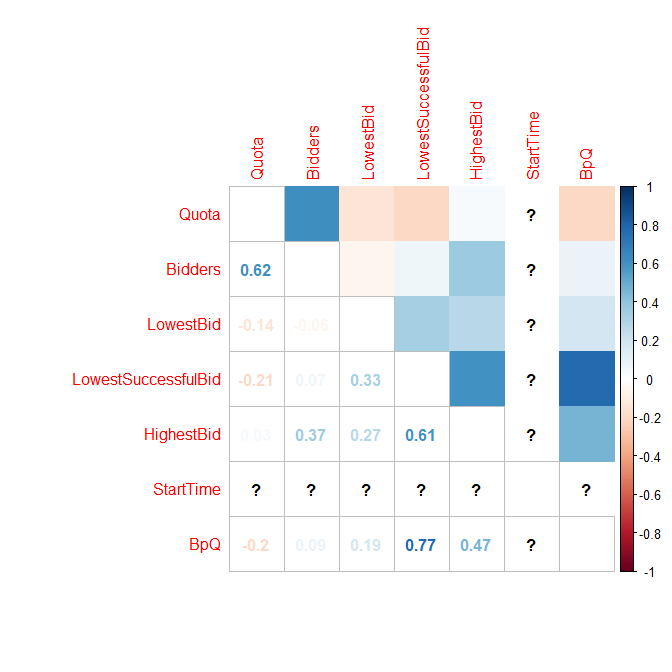

NUSmodAn
================
Aaron0696

  - [Set Up](#set-up)
  - [Extract Data](#extract-data)
      - [Bidding Data From `nusmods`](#bidding-data-from-nusmods)
      - [Load `mydata.RDS`](#load-mydata.rds)
      - [Module Information](#module-information)
      - [Load `myModInfo.RDS`](#load-mymodinfo.rds)
  - [Transform Data](#transform-data)
      - [`myModInfo`](#mymodinfo)
      - [`mydata`](#mydata)
  - [Explore Data](#explore-data)
      - [Univariate Descriptive
        Statistics](#univariate-descriptive-statistics)
      - [Univariate Histograms](#univariate-histograms)
      - [Bivariate Plots](#bivariate-plots)
  - [Is It Easier To Bid For Modules With Extremely Early/Late
    Lectures?](#is-it-easier-to-bid-for-modules-with-extremely-earlylate-lectures)

# Set Up

``` r
library(semTools)
library(ggplot2)
library(rjson)
library(stringr)
library(DT)
library(psych)
library(corrplot)
library(dplyr)
options(width = 999)
```

# Extract Data

## Bidding Data From `nusmods`

``` r
# load bidding data
# calculate loading times
before <- Sys.time()
# read data directly from URL
myjson <- fromJSON(file = url("https://api.nusmods.com/corsBiddingStatsRaw.json"))
# create empty dataframe which will act as a container to be populated with data
mydata <- data.frame()
# for each element in the myjson list, append it to mydata
for(r in 1:length(myjson))
{
  if(myjson[[r]]$Semester == 1 | myjson[[r]]$Semester == 2)
  {
    mydata <- rbind(mydata, myjson[[r]])
  }
  myjson[[r]] <- NA
}
# calculate loading time
after <- Sys.time()
after - before
# remove myjson to free up some RAM
rm(myjson)
# peek at the data
head(mydata)
tail(mydata)
# data struct
str(mydata)
# save
saveRDS(mydata, file = "mydata.RDS")
```

## Load `mydata.RDS`

``` r
mydata <- readRDS("mydata.RDS")
```

## Module Information

``` r
myjson <- fromJSON(file = url("https://nusmods.com/api/moduleTimetableDeltaRaw.json"))
# create empty dataframe which will act as a container to be populated with data
myModInfo <- data.frame()
# for each element in the myjson list, append it to mydata
for(r in 1:length(myjson))
{
  if(myjson[[r]]$Semester == 1 | myjson[[r]]$Semester == 2)
  {
    myModInfo <- rbind(myModInfo, myjson[[r]])
  }
  myjson[[r]] <- NA
}

# save
saveRDS(myModInfo, file = "myModInfo.RDS")
```

## Load `myModInfo.RDS`

``` r
myModInfo <- readRDS("myModInfo.RDS")
```

# Transform Data

## `myModInfo`

``` r
# only keep the Psychology modules information
myModInfo <- subset(myModInfo,
                     str_detect(myModInfo$ModuleCode, "^PL"))
# remove information about tutorials
myModInfo <- subset(myModInfo,
                    myModInfo$LessonType != "TUTORIAL")
# only keep these columns
myModInfo <- myModInfo[,grep("ModuleCode|DayText|StartTime|Semester|AcadYear", names(myModInfo))]
# remove duplicated rows based on columns of ModuleCode, Acadyear and Semester
myModInfo <- distinct(myModInfo, 
                      ModuleCode, AcadYear, Semester, StartTime, DayText)
```

## `mydata`

``` r
# remove non-psychology modules
mydata <- subset(mydata,
                 # only keep rows where module code begins with PL
                 str_detect(mydata$ModuleCode, "^PL"))
# remove core psychology modules, they are PL323[2 to 6], PL1101E, PL2131, PL2132.
# also remove Roots and Wings (PLS8001) and psychology for non-psych students (PLB1201)
mydata <- subset(mydata,
                 !str_detect(mydata$ModuleCode, "PLS|PLB"))

# remove the rounds where it was reserved
mydata <- subset(mydata,
                     !str_detect(mydata$StudentAcctType, "Reserved"))

# remove unneeded columns
mydata <- mydata[, -grep("Group|Faculty", names(mydata))]

# create new column that indicates the level of the module, based on their module code
# since I removed all the level 1 and level 2 modules in the lines above, technically I dont require the first two
# ifelse conditions, but I'll leave it here as a demonstration.
mydata$Level <- ifelse(str_detect(mydata$ModuleCode, "1[0-9][0-9][0-9]"), "Level 1",
                       ifelse(str_detect(mydata$ModuleCode, "2[0-9][0-9][0-9]"), "Level 2",
                              ifelse(str_detect(mydata$ModuleCode, "3[0-9][0-9][0-9]"), "Level 3",
                                     ifelse(str_detect(mydata$ModuleCode, "4[0-9][0-9][0-9]"), "Level 4", 
                                            "Graduate Module"))))
# crosstabs to doublecheck
xtabs( ~ ModuleCode + Level, 
       data = mydata, subset = NULL)
```

    ##           Level
    ## ModuleCode Level 1 Level 2 Level 3 Level 4
    ##    PL1101E     182       0       0       0
    ##    PL2131        0      90       0       0
    ##    PL2132        0      92       0       0
    ##    PL3232        0       0     134       0
    ##    PL3233        0       0     117       0
    ##    PL3234        0       0     120       0
    ##    PL3235        0       0     112       0
    ##    PL3236        0       0     121       0
    ##    PL3237        0       0      49       0
    ##    PL3238        0       0      35       0
    ##    PL3239        0       0      41       0
    ##    PL3240        0       0      39       0
    ##    PL3241        0       0      57       0
    ##    PL3242        0       0      56       0
    ##    PL3243        0       0      21       0
    ##    PL3244        0       0      29       0
    ##    PL3248        0       0      31       0
    ##    PL3249        0       0      28       0
    ##    PL3250        0       0      27       0
    ##    PL3251        0       0      16       0
    ##    PL3252        0       0      29       0
    ##    PL3253        0       0      10       0
    ##    PL3254        0       0      36       0
    ##    PL3255        0       0      28       0
    ##    PL3256        0       0      17       0
    ##    PL3257        0       0      17       0
    ##    PL3258        0       0      21       0
    ##    PL3259        0       0      15       0
    ##    PL3260        0       0       4       0
    ##    PL3261        0       0      19       0
    ##    PL3281        0       0      40       0
    ##    PL3281A       0       0      51       0
    ##    PL3281B       0       0      10       0
    ##    PL3281C       0       0      18       0
    ##    PL3281D       0       0      40       0
    ##    PL3282        0       0      27       0
    ##    PL3282A       0       0      13       0
    ##    PL3282C       0       0       6       0
    ##    PL3283        0       0       5       0
    ##    PL3283A       0       0       6       0
    ##    PL3283B       0       0      29       0
    ##    PL3284        0       0      44       0
    ##    PL3285        0       0       6       0
    ##    PL3286        0       0      37       0
    ##    PL3287        0       0      21       0
    ##    PL3288        0       0      22       0
    ##    PL3289        0       0       1       0
    ##    PL4201        0       0       0      28
    ##    PL4202        0       0       0      32
    ##    PL4203        0       0       0      45
    ##    PL4205        0       0       0      30
    ##    PL4206        0       0       0      43
    ##    PL4207        0       0       0      20
    ##    PL4208        0       0       0      13
    ##    PL4213        0       0       0      22
    ##    PL4214        0       0       0      21
    ##    PL4217        0       0       0      13
    ##    PL4218        0       0       0      23
    ##    PL4219        0       0       0      25
    ##    PL4220        0       0       0      12
    ##    PL4221        0       0       0      44
    ##    PL4222        0       0       0      37
    ##    PL4223        0       0       0      14
    ##    PL4224        0       0       0      17
    ##    PL4225        0       0       0       4
    ##    PL4226        0       0       0      18
    ##    PL4227        0       0       0      24
    ##    PL4228        0       0       0      17
    ##    PL4229        0       0       0      20
    ##    PL4230        0       0       0       7
    ##    PL4231        0       0       0      17
    ##    PL4232        0       0       0       5
    ##    PL4233        0       0       0       3
    ##    PL4234        0       0       0      22
    ##    PL4235        0       0       0      26
    ##    PL4237        0       0       0      29
    ##    PL4238        0       0       0      11
    ##    PL4239        0       0       0       2
    ##    PL4240        0       0       0       4
    ##    PL4241        0       0       0       5
    ##    PL4880F       0       0       0      16
    ##    PL4880G       0       0       0      17
    ##    PL4880H       0       0       0       8
    ##    PL4880I       0       0       0       6
    ##    PL4880J       0       0       0      18
    ##    PL4880K       0       0       0       8
    ##    PL4880L       0       0       0      19
    ##    PL4880N       0       0       0       4
    ##    PL4880P       0       0       0       7
    ##    PL4880Q       0       0       0       4
    ##    PL4880R       0       0       0      15

``` r
# datatable *htmlwidget
# datatable(mydata, filter = "top", width = 600)

mydata <- merge(x = mydata, 
                 # exclude the columns of AcadYear and Semester as duplicate column messes up the function
                 y = myModInfo,
                 by = c("ModuleCode", "AcadYear", "Semester"),
                 all.x = TRUE,
                 all.y = FALSE)

# transform these columns to numeric
for(r in c("Quota", "Bidders", "LowestBid", "LowestSuccessfulBid", "HighestBid", "StartTime"))
{
  mydata[,grep(r, names(mydata))] <- as.numeric(mydata[,grep(r, names(mydata))])
}
# transform these columns to factors
for(r in c("AcadYear", "Semester", "ModuleCode", "Round", "Level", "StudentAcctType", "DayText"))
{
  mydata[,grep(r, names(mydata))] <- factor(mydata[,grep(r, names(mydata))])
}

# create new column Bids Per Quota (BpQ)
mydata$BpQ <- with(mydata, Bidders/Quota)
# create vector of the column names which are factors
facnames <- names(select_if(mydata, is.factor))
facnames.mod <- facnames[-grep("ModuleCode", facnames)]
# create vector of the column names which are numeric
numnames <- names(select_if(mydata, is.numeric))
```

# Explore Data

## Univariate Descriptive Statistics

``` r
describe(mydata)
```

``` r
summary(mydata)
```

    ##    ModuleCode        AcadYear   Semester Round        Quota           Bidders         LowestBid       LowestSuccessfulBid   HighestBid                                        StudentAcctType     Level        StartTime         DayText          BpQ          
    ##  PL1101E: 230   2011/2012:460   1:1587   1A:640   Min.   :  1.00   Min.   :  0.00   Min.   :   0.00   Min.   :   0        Min.   :   0.0   New Students [P]                           : 319   Level 1: 230   Min.   : 800   Friday   : 102   Min.   : 0.00000  
    ##  PL3232 : 134   2013/2014:449   2:1291   1B:386   1st Qu.:  4.00   1st Qu.:  1.00   1st Qu.:   1.00   1st Qu.:   1        1st Qu.:   1.0   NUS Students [G]                           : 135   Level 2: 182   1st Qu.:1200   Monday   : 116   1st Qu.: 0.02128  
    ##  PL3236 : 121   2015/2016:423            1C:289   Median : 14.00   Median :  3.00   Median :   1.00   Median :   1        Median : 350.0   NUS Students [P, G]                        : 339   Level 3:1623   Median :1400   Thursday : 159   Median : 0.30000  
    ##  PL3234 : 120   2014/2015:398            2A:419   Mean   : 25.09   Mean   : 12.38   Mean   :  69.39   Mean   : 251        Mean   : 718.1   NUS Students [P]                           : 336   Level 4: 843   Mean   :1336   Tuesday  : 134   Mean   : 1.01954  
    ##  PL3235 : 119   2016/2017:349            2B:467   3rd Qu.: 32.00   3rd Qu.:  9.00   3rd Qu.:   8.00   3rd Qu.: 201        3rd Qu.:1232.8   Returning Students [P]                     :1231                  3rd Qu.:1575   Wednesday: 143   3rd Qu.: 1.25000  
    ##  PL3233 : 117   2012/2013:345            3A:376   Max.   :430.00   Max.   :491.00   Max.   :2430.00   Max.   :3459        Max.   :4801.0   Returning Students [P] and NUS Students [G]: 171                  Max.   :1800   NA's     :2224   Max.   :18.00000  
    ##  (Other):2037   (Other)  :454            3B:301                                                                                            Returning Students and New Students [P]    : 347                  NA's   :2224

## Univariate Histograms

<details>

<summary>View Histograms</summary>

``` r
# plot the categorical variables
# note: I did not include ModuleCode in this exploratory graph because it has too many levels (83)
for(r in facnames.mod)
{
  cat(paste0("Histogram Of ", r))
  
  plot(
    ggplot(data = mydata, aes_string(x = r, fill = r)) + 
  geom_histogram(stat = "count") + 
  ylab("Count") +
  ggtitle(paste0("Count of ", r)) +
  theme_classic() + 
  theme(axis.text.x = element_text(angle = 90, size = 10, vjust = -1),
        axis.title.x = element_blank())
  )
}
```

    ## Histogram Of AcadYear

<!-- -->

    ## Histogram Of Semester

<!-- -->

    ## Histogram Of Round

<!-- -->

    ## Histogram Of StudentAcctType

<!-- -->

    ## Histogram Of Level

<!-- -->

    ## Histogram Of DayText

<!-- -->

``` r
# plot the continuous variables
for(r in numnames)
{
  cat(paste0("Histogram Of ", r))
  
  plot(
    ggplot(data = mydata, aes_string(x = r, fill = r)) + 
  geom_histogram(bins = 90, fill = "violetred") + 
  ylab("Histogram") +
  ggtitle(paste0("Frequency of ", r)) +
  theme_classic() + 
  theme(axis.text.x = element_text(angle = 90, size = 10, vjust = -1),
        axis.title.x = element_text())
  )
}
```

    ## Histogram Of Quota

<!-- -->

    ## Histogram Of Bidders

<!-- -->

    ## Histogram Of LowestBid

<!-- -->

    ## Histogram Of LowestSuccessfulBid

<!-- -->

    ## Histogram Of HighestBid

<!-- -->

    ## Histogram Of StartTime

<!-- -->

    ## Histogram Of BpQ

<!-- -->

</details>

## Bivariate Plots

<details>

<summary>View Categorical-Categorical Bivariate Plots</summary>

### Categorical-Categorical

``` r
# create vector to loop across
for(r in 1:length(facnames.mod))
{
  for(i in 1:length(facnames.mod))
  {
   # dont do anything if they are the same or the graph has been made before
   if(i == r | i < r)
   {
   } else {
     cat(paste0(facnames.mod[r]," ~ ",facnames.mod[i]))
     
     # create formula for xtabs
     tempform <- paste0("~ ", facnames.mod[r], " + ", facnames.mod[i])
     # temp is a dataframe that is only going to exist in this section
     # and overwritten with each loop
     temp <- as.data.frame(xtabs(eval(parse(text = tempform)),
                            data = mydata,
                            subset = NULL))
     plot(
       ggplot(data = temp, aes_string(x = facnames.mod[r], y = facnames.mod[i], fill = "Freq", label = "Freq")) +
         geom_tile() + 
         geom_text() + 
         scale_fill_gradient(low = "white", high = "violetred") + 
         theme_minimal() + 
         theme(axis.text.x = element_text(angle = 90, size = 10, vjust = -1))
     )
   }
  }
}
```

    ## AcadYear ~ Semester

<!-- -->

    ## AcadYear ~ Round

<!-- -->

    ## AcadYear ~ StudentAcctType

<!-- -->

    ## AcadYear ~ Level

<!-- -->

    ## AcadYear ~ DayText

<!-- -->

    ## Semester ~ Round

<!-- -->

    ## Semester ~ StudentAcctType

<!-- -->

    ## Semester ~ Level

<!-- -->

    ## Semester ~ DayText

<!-- -->

    ## Round ~ StudentAcctType

<!-- -->

    ## Round ~ Level

<!-- -->

    ## Round ~ DayText

<!-- -->

    ## StudentAcctType ~ Level

<!-- -->

    ## StudentAcctType ~ DayText

<!-- -->

    ## Level ~ DayText

<!-- -->

</details>

<details>

<summary>View Continuous-Continuous Bivariate Plots</summary>

### Continuous-Continuous

``` r
for(r in 1:length(numnames))
{
  for(i in 1:length(numnames))
  {
   # dont do anything if they are the same or the graph has been made before
   if(i == r | i < r)
   {
   } else {
     cat(paste0(numnames[r]," ~ ",numnames[i]))
     # create formula for lm()
     tempform.std <- paste0("scale(", numnames[i],")", " ~ ", "scale(", numnames[r], ")")
     tempform <- paste0(numnames[i], " ~ ", numnames[r])
     # regress to get best fit line
     # standardized
     stdreg <- lm(eval(parse(text = tempform.std)),
               data = mydata)
     # unstandardized
     reg <- lm(eval(parse(text = tempform)),
               data = mydata)
     
     plot(
       ggplot(data = mydata, aes_string(x = numnames[r], y = numnames[i])) +
         geom_point(color = "violetred", size = 2, alpha = 0.5) +
         theme_classic() + 
         geom_abline(slope = reg$coefficients[2], intercept = reg$coefficients[1], lty = "dashed") + 
         geom_label(aes(x = Inf, y = Inf, label = paste0("Standardized Regression Coefficient = ",
                                                         round(stdreg$coefficients[2],3)),
                        hjust = 1, vjust = 1)) + 
         theme(axis.text.x = element_text(angle = 90, size = 10, vjust = -1))
     )
   }
  }
}
```

    ## Quota ~ Bidders

<!-- -->

    ## Quota ~ LowestBid

<!-- -->

    ## Quota ~ LowestSuccessfulBid

<!-- -->

    ## Quota ~ HighestBid

<!-- -->

    ## Quota ~ StartTime

<!-- -->

    ## Quota ~ BpQ

<!-- -->

    ## Bidders ~ LowestBid

<!-- -->

    ## Bidders ~ LowestSuccessfulBid

<!-- -->

    ## Bidders ~ HighestBid

<!-- -->

    ## Bidders ~ StartTime

<!-- -->

    ## Bidders ~ BpQ

<!-- -->

    ## LowestBid ~ LowestSuccessfulBid

<!-- -->

    ## LowestBid ~ HighestBid

<!-- -->

    ## LowestBid ~ StartTime

<!-- -->

    ## LowestBid ~ BpQ

<!-- -->

    ## LowestSuccessfulBid ~ HighestBid

<!-- -->

    ## LowestSuccessfulBid ~ StartTime

<!-- -->

    ## LowestSuccessfulBid ~ BpQ

<!-- -->

    ## HighestBid ~ StartTime

<!-- -->

    ## HighestBid ~ BpQ

<!-- -->

    ## StartTime ~ BpQ

<!-- -->

</details>

<details>

<summary>View Correlation Matrix</summary>

### Correlation Matrix

``` r
corrplot.mixed(cor(select_if(mydata, is.numeric)),
               upper = "color",
               tl.pos = "lt")
```

<!-- -->

<details>

<summary>View Continuous-Categorical Bivariate Plots</summary>

### Continuous-Categorical

``` r
for(r in facnames.mod)
{
  for(i in numnames)
  {
    cat(paste0(r," ~ ",i))
    # graph
    plot(
      ggplot(data = mydata, aes_string(x = r, y = i, fill = r)) + 
      geom_bar(stat = "identity") + 
      theme_classic() + 
      theme(legend.position = "none",
            axis.text.x = element_text(angle = 90, size = 10, vjust = -1))
    )
  }
}
```

    ## AcadYear ~ Quota

<!-- -->

    ## AcadYear ~ Bidders

<!-- -->

    ## AcadYear ~ LowestBid

<!-- -->

    ## AcadYear ~ LowestSuccessfulBid

<!-- -->

    ## AcadYear ~ HighestBid

<!-- -->

    ## AcadYear ~ StartTime

<!-- -->

    ## AcadYear ~ BpQ

<!-- -->

    ## Semester ~ Quota

<!-- -->

    ## Semester ~ Bidders

<!-- -->

    ## Semester ~ LowestBid

<!-- -->

    ## Semester ~ LowestSuccessfulBid

<!-- -->

    ## Semester ~ HighestBid

<!-- -->

    ## Semester ~ StartTime

<!-- -->

    ## Semester ~ BpQ

<!-- -->

    ## Round ~ Quota

<!-- -->

    ## Round ~ Bidders

<!-- -->

    ## Round ~ LowestBid

<!-- -->

    ## Round ~ LowestSuccessfulBid

<!-- -->

    ## Round ~ HighestBid

<!-- -->

    ## Round ~ StartTime

<!-- -->

    ## Round ~ BpQ

<!-- -->

    ## StudentAcctType ~ Quota

<!-- -->

    ## StudentAcctType ~ Bidders

<!-- -->

    ## StudentAcctType ~ LowestBid

<!-- -->

    ## StudentAcctType ~ LowestSuccessfulBid

<!-- -->

    ## StudentAcctType ~ HighestBid

<!-- -->

    ## StudentAcctType ~ StartTime

<!-- -->

    ## StudentAcctType ~ BpQ

<!-- -->

    ## Level ~ Quota

<!-- -->

    ## Level ~ Bidders

<!-- -->

    ## Level ~ LowestBid

<!-- -->

    ## Level ~ LowestSuccessfulBid

<!-- -->

    ## Level ~ HighestBid

<!-- -->

    ## Level ~ StartTime

<!-- -->

    ## Level ~ BpQ

<!-- -->

    ## DayText ~ Quota

<!-- -->

    ## DayText ~ Bidders

<!-- -->

    ## DayText ~ LowestBid

<!-- -->

    ## DayText ~ LowestSuccessfulBid

<!-- -->

    ## DayText ~ HighestBid

<!-- -->

    ## DayText ~ StartTime

<!-- -->

    ## DayText ~ BpQ

<!-- -->

</details>

<details>

<summary>View Continuous-Module Bivariate Plots</summary>

### By Module

``` r
for(i in numnames)
{
  cat(paste0("ModuleCode"," ~ ",i))
  # graph
  plot(
    ggplot(data = mydata, aes_string(x = "ModuleCode", y = i, fill = "ModuleCode")) + 
      geom_bar(stat = "identity") + 
      theme_classic() + 
      theme(legend.position = "none",
            axis.text.x = element_text(angle = 90, size = 10, vjust = -1)) + 
      coord_flip()
  )
}
```

    ## ModuleCode ~ Quota

<!-- -->

    ## ModuleCode ~ Bidders

<!-- -->

    ## ModuleCode ~ LowestBid

<!-- -->

    ## ModuleCode ~ LowestSuccessfulBid

<!-- -->

    ## ModuleCode ~ HighestBid

<!-- -->

    ## ModuleCode ~ StartTime

<!-- -->

    ## ModuleCode ~ BpQ

<!-- -->

</details>

# Is It Easier To Bid For Modules With Extremely Early/Late Lectures?

``` r
# testing
```
