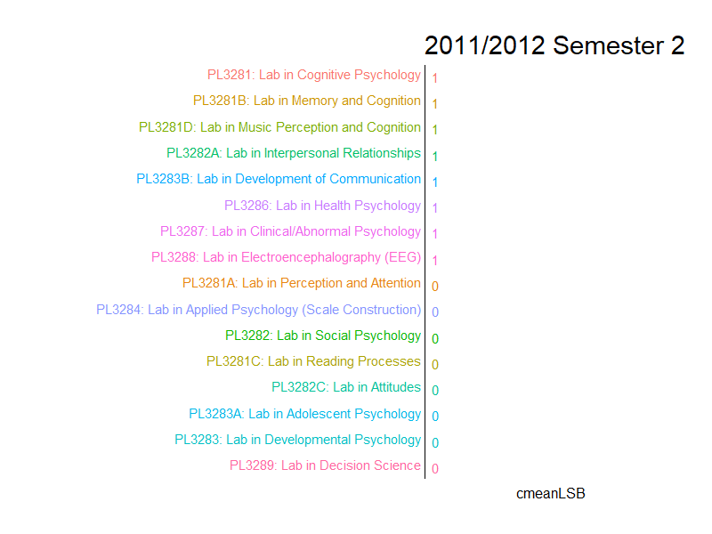
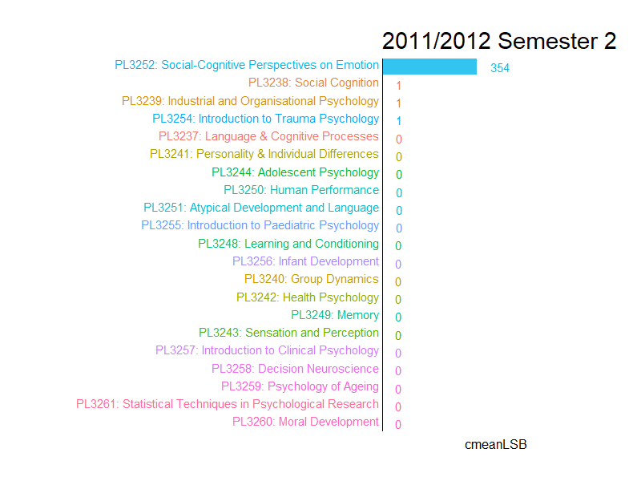

<style>
p.caption {
  font-size: 0.8em;
}

div.tom { background-color:#e6ffff; border-radius: 5px; padding: 20px;}
div.green { background-color:#b3ffe6; border-radius: 5px; padding: 20px;}
</style>

```{r render, eval = FALSE, include = FALSE}
# for github markdown
htmlswitch <- FALSE
gitswitch <- TRUE
rmarkdown::render(input = "psychmods.Rmd",
                  output_format = "github_document",
                  output_file = "README.md")

# for html
htmlswitch <- TRUE
gitswitch <- TRUE
rmarkdown::render(input = "psychmods.Rmd",
                  output_format = "html_document",
                  output_file = "docs/index.html")
```

# TL:DR/Summary {.tabset}

<div style="line-height: 2em;">
The characteristics of popular/unpopular modules were discussed and module bidding statistics were utilized as indicators of these characteristics. With the bidding statistics as indicators of popularity, we found the most and least popular Elective, Lab and Honour modules. In addition to the list of popular/unpopular modules, we also noticed that Cognitive and Biological Psychology modules were underrepresented in the list of popular modules and overrepresented in the list of unpopular modules. Within the limits of the current data and analysis, it seems fair to say that Cognitive and Biological Psychology modules tend to be less popular. The ranked list of modules that would also be useful in guiding balloting preferences for future undergraduates.

<div class = "green">
This was a personal project by me, using data from [NUSMods](nusmods.com). Most of the heavy lifting in this project was extracting, wrangling, visualizing and understanding the data. I wrote this post to help consolidate my understanding of the data while at the same time provide some useful insights with various visualizations. This understanding was important to me as I intend to conduct further projects/analysis on the extracted data.

The below sections are split into two large chunks. The `Codes` tab would display the codes that I used to extract and wrangle the data. The `Post` tab is a little write-up that attempts to find the most popular modules in NUS Psychology. The codes and documents that I used to generate this page can also be found in the [Github Repository](https://github.com/Aaron0696/psychmods). I can also be contacted through [LinkedIn](https://www.linkedin.com/in/aaron-lim-b30898135/) or my email at aronlimjm@gmail.com.

</div>
</div>
<br>

## Codes

### Phase 1: Setting Up Environment, Packages And Loading Data {.tabset .tabset-fade .tabset-pills}

#### Packages And Chunk Options

```{r setup, warning = FALSE, message = FALSE, class.source = "fold-show"}
library(psych)
library(semTools)
library(ggplot2)
library(rjson)
library(stringr)
library(DT)
library(corrplot)
library(tidyverse)
library(forcats)
library(lme4)
library(shiny)
library(semTools)
library(plotly)
library(gganimate)
library(semTools)
# options(width = 999)
# chunk options defaults
knitr::opts_chunk$set(dpi = 96, out.width = "50%", out.height = "50%")
```

#### Load Bidding Data

* Extract data from `nusmods` at https://api.nusmods.com/.
* After loading the data in `.JSON` format, convert to a dataframe.

```{r extract, eval = FALSE, class.source = "fold-show"}
myBid <- data.frame() # create empty dataframe which will act as a container to be populated with data
for(year in c(2011:2018)) # looping through each year
{
  for(semester in c(1,2)) # looping through semesters
  {
    if(year == 2017 & semester == 2) # there is no cors biding data for 2017/2018 sem 2
    {
    } else if(year == 2018 & semester == 2) # there is no cors biding data for 2018/2019 sem 2
    {
    } else
    {
      # create the url where data is to be extracted from
      myurl <- paste0("https://api.nusmods.com/", year, "-", year + 1, "/", semester, "/corsBiddingStatsRaw.json")
      myjson <- fromJSON(file = url(myurl))
      for(r in 1:length(myjson)) # for each element in the myjson list, append it to myModInfo
      {
        if(isTRUE(str_detect(myjson[[r]][["ModuleCode"]], "^PL"))) # only keep info if module code begins with PL
        {
          if(myjson[[r]][["Semester"]] == "1" | myjson[[r]][["Semester"]] == "2") # only get semester 1 and 2 information
          {
            myBid <- rbind(myBid, myjson[[r]]) # add to dataframe
          }
        }
        myjson[[r]] <- NA # replace the element with NA to free up some rAM
      }
    }
    cat(year, "Semester", semester, "Done!") # progress tracker
  }
}
saveRDS(myBid, file = "myBid.RDS") # save to directory
```

#### Load `myBid.RDS`

* Downloading the data from the API using the code above takes a substantial amount of time.
* I saved the downloaded data in `myBid.RDS` and load it directly from my local folder while I worked on the project.

```{r loadbid, class.source = "fold-show"}
myBid <- readRDS("myBid.RDS")
```    

#### Load Module Information

* Module information was scattered across different folders.
* Used a loop to repeat the process of downloading and converting to dataframe across the different folders accessed by the different URLs.
    * The same concept was used to consolidate information about the Module Titles.

```{r extract2, eval=FALSE, class.source = "fold-show"}
myModInfo <- data.frame() # create empty dataframe which will act as a container to be populated with data
for(year in c(2011:2018)) # looping through each year
{
  for(semester in c(1,2))
  {
    # create the url where data is to be extracted from
    myurl <- paste0("https://api.nusmods.com/", year, "-", year + 1, "/", semester, "/moduleTimetableDeltaRaw.json")
    myjson <- fromJSON(file = url(myurl))
    for(r in 1:length(myjson)) # for each element in the myjson list, append it to myModInfo
    {
      if(isTRUE(str_detect(myjson[[r]]$ModuleCode, "^PL"))) # only keep info if module code begins with PL
      {
        if(myjson[[r]]$Semester == 1 | myjson[[r]]$Semester == 2) # only get semester 1 and 2 information
        {
          myModInfo <- rbind(myModInfo, myjson[[r]]) # add to dataframe
        }
      }
      myjson[[r]] <- NA # replace the element with NA to free up some rAM
    }
    cat(year, "Semester", semester, "Done!") # progress tracker
  }
}

myTitles <- data.frame() # create empty dataframe which will act as a container to be populated with data
for(year in c(2014:2018)) # looping through each year
{
    myurl <- paste0("https://api.nusmods.com/", year, "-", year + 1, "/moduleList.json") # create the url where data is to be extracted from
    myjson <- fromJSON(file = url(myurl))
    for(r in 1:length(myjson)) # for each element in the myjson list, append it to myModInfo
    {
      if(isTRUE(str_detect(myjson[[r]]$ModuleCode, "^PL"))) # only keep info if module code begins with PL
      {
        if(paste0(myjson[[r]]$Semester, collapse = "|") == "1"|
           paste0(myjson[[r]]$Semester, collapse = "|") == "2"|
           paste0(myjson[[r]]$Semester, collapse = "|") == "1|2") # only keep information from semester 1 and 2
        {
          myTitles <- rbind(myTitles, as.data.frame(myjson[[r]])) # add to dataframe
        }
      }
      myjson[[r]] <- NA # free RAM
    }
}

myModInfo <- myTitles %>% # add titles information to myModInfo
  select(ModuleCode, ModuleTitle) %>% # select these two columns
  filter(ModuleTitle != "Lab in Applied Psychology") %>% # there were two variations of this title, remove the older one
  distinct() %>% # remove duplicates
  right_join(myModInfo, by = "ModuleCode") # left = myTitles, right = myModInfo

saveRDS(myModInfo, file = "myModInfo.RDS") # save to directory
```

#### Load `myModInfo.RDS`

* Downloading the data from the API using the code above takes a substantial amount of time.
* I saved the downloaded data in `myModInfo.RDS` and load the data directly while I worked on the project.

```{r loadmod, class.source = "fold-show"}
myModInfo <- readRDS("myModInfo.RDS")
```

### Phase 2: Filter, Transform And Merge {.tabset .tabset-fade .tabset-pills}
    
#### Module Information

* Filter information from the dataframe `myModInfo`.
    * Removing non-Psychology modules.
    * Removing modules without module titles, these are modules that appeared before AY2014/2015 and never resurfaced afterwards.
    * Removing information about tutorials.

```{r filtermod, class.source = "fold-show"}
myModInfo <- myModInfo %>%
  select(-LastModified, -LastModified_js, -isDelete) %>% # remove these columns
  filter(str_detect(ModuleCode, "^PL")) %>% # removing non-Psychology modules
  filter(!is.na(ModuleTitle)) %>% # removing modules without module titles #PL3285, PL4220, PL4217
  filter(LessonType != "TUTORIAL") %>% # removing information about tutorials
  select(AcadYear, Semester, ModuleCode, ModuleTitle, DayText, StartTime, Semester, ClassNo) %>%# select these columns
  distinct(AcadYear, Semester, ModuleCode, ClassNo, DayText, StartTime, .keep_all = TRUE) # remove duplicates
modrow <- nrow(myModInfo) # get number of rows of myMoInfo
myModInfo <- myModInfo %>%
  mutate(rowindex = 1:modrow) %>% # create new row that is the row number
  arrange(-rowindex) %>% # invert the dataframe, make it upside down, reason: latest entry are appended to the bottom of the dataframe!
  distinct(AcadYear, Semester, ModuleCode, ClassNo, .keep_all = TRUE) %>% # remove duplicates based on these columns
  select(-rowindex) # remove rowindex

tail(myModInfo) # peek
```  
    
#### Bidding Information

* Filter information from the dataframe `myBid`.
    * Removing non-Psychology modules, including Roots and Wings (prefixed with PLS-) and Psychology for non-Psychology students (prefixed with PLB-).
    * Removing information from quotas that are reserved and not available for bidding.
    * Removing information from modules with more than one lecture/seminar session.
    * Removing bidding information from non-psychology students.
* Create new variable *ClassNo* by transforming from *Group* such that this information can be used to merge with `myModInfo`.

```{r filterbid, class.source = "fold-show"}
myBid <- myBid %>%
  filter(str_detect(ModuleCode, "^PL")) %>% # removing non-Psychology modules
  filter(!str_detect(ModuleCode, "PLS|PLB")) %>% # remove PLS and PLB modules
  filter(!str_detect(StudentAcctType, "Reserved")) %>% # remove reserved rounds
  filter(!str_detect(StudentAcctType, "[G]")) %>% # remove bidding information from non-psychology students
  select(-Faculty) %>%  # remove this columns
  mutate(Group1 = gsub("-", "", Group)) %>% # remove hyphens such that it works with parse_number()
  mutate(ClassNo = as.character(parse_number(Group1))) # new column signifying which lecture slots for modules with >1 lecture slots

head(myBid) # peek
```

#### Merge

* Combine the information of `myModInfo` and `myBid`.

```{r merge, class.source = "fold-show"}
# modules that do not appear in both dataframes are dropped
mydata <- inner_join(myBid, 
                     myModInfo,
                     by = c("ModuleCode", "AcadYear", "Semester", "ClassNo"))
head(mydata) # peek
```

### Phase 3: Data Wrangling {.tabset .tabset-fade .tabset-pills}

* The variables available in the original data are useful but they are too specific to interpret meaningfully.
* This section creates new variables based on the original data and allow us to better discern any trend in the data.
* Also includes additional wrangling and manipulations to ease the plotting of graphs and analysis later.

#### Coercing Columns

```{r coerce, class.source = "fold-show"}
# transform these columns to numeric
for(r in c("Quota", "Bidders", "LowestBid", "LowestSuccessfulBid", "HighestBid", "StartTime"))
{
  mydata[,grep(r, names(mydata))] <- as.numeric(mydata[,grep(r, names(mydata))])
}
# transform these columns to factors
for(r in c("AcadYear", "Semester", "ModuleCode", "Round", "StudentAcctType", "DayText", "StudentAcctType", "ModuleTitle", "Group$", "ClassNo"))
{
  mydata[,grep(r, names(mydata))] <- factor(mydata[,grep(r, names(mydata))])
}
```

#### Rearranging `DayText` Levels

```{r daytext, class.source = "fold-show"}
mydata$DayText <- factor(mydata$DayText,
                         levels = c("Monday", "Tuesday", "Wednesday", "Thursday", "Friday"))
```

#### Shortening `StudentAcctType` Levels

```{r shortacct, class.source = "fold-show"}
mydata <- mutate(mydata, StudentAcctType = fct_recode(StudentAcctType, 
                                                      "New[P]" = "New Students [P]",
                                                      "NUS[P]" = "NUS Students [P]",
                                                      "Return[P]" = "Returning Students [P]",
                                                      "ReturnNew[P]" = "Returning Students and New Students [P]"))
```

#### Shortening `Group` Levels

```{r shortgrp, class.source = "fold-show"}
mydata <- mutate(mydata, Group = fct_recode(Group, 
                                                      "LEC1" = "LECTURE 1",
                                                      "LEC2" = "LECTURE 2",
                                                      "SEMINAR1" = "SEMINAR-STYLE MODULE CLASS 1",
                                                      "SEMINAR2" = "SEMINAR-STYLE MODULE CLASS 2"))
```

#### New Variable: Level

```{r create1, class.source = "fold-show"}
# create new variable that indicates the level of the module, based on their module code
mydata$Level <- factor(ifelse(str_detect(mydata$ModuleCode, "1[0-9][0-9][0-9]"), "Level 1",
                      ifelse(str_detect(mydata$ModuleCode, "2[0-9][0-9][0-9]"), "Level 2",
                             ifelse(str_detect(mydata$ModuleCode, "3[0-9][0-9][0-9]"), "Level 3",
                                    ifelse(str_detect(mydata$ModuleCode, "4[0-9][0-9][0-9]"), "Level 4", 
                                           "Graduate Module")))))
```

#### New Variable: BidPerQuota

```{r create2, class.source = "fold-show"}
# BidPerQuota = Bidders/Quota
mydata$BidPerQuota <- with(mydata, Bidders/Quota)
```

#### New Variable: DayPeriod

```{r create3, class.source = "fold-show"}
mydata$Period <- factor(ifelse(mydata$StartTime < 1200, "Morning", ">=Afternoon"),
                           levels = c("Morning", ">=Afternoon"))
```

#### New Variable: Category

```{r create4, class.source = "fold-show"}
mydata$Category <- ifelse(str_detect(mydata$ModuleCode, "^PL328"), "Lab",
                          ifelse(str_detect(mydata$ModuleCode, "^PL4[0-9][0-9][0-9]"), "Honour",
                                 ifelse(str_detect(mydata$ModuleCode, "PL323[2-6]|PL1101|PL213[1-2]"), "Core", "Elective")))
mydata$Category <- factor(mydata$Category,
                         levels = c("Core", "Elective", "Lab", "Honour"))
```

#### Vector Of Column Names

```{r colvecs, class.source = "fold-show"}
# create vector of the column names which are factors
facnames <- mydata %>% select_if(is.factor) %>% names()
# facnames without ModuleCode and StudentAcctType
facnames.mod <- facnames[-grep("ModuleCode|ModuleTitle", facnames)]
# create vector ofthe column names which are numeric
numnames <- mydata %>% select_if(is.numeric) %>% names()
# numnames without StartTime
numnames.time <- names(select_if(mydata, is.numeric))[-grep("StartTime", numnames)]
```

#### Identify Modules With Multiple Module Codes {.active}

```{r colmodcode, class.source = "fold-show"}
for(r in unique(mydata$ModuleTitle))
{
  # if a moduletitle possesses more than one unique module code...
  if(length(unique(mydata$ModuleCode[mydata$ModuleTitle == r])) != 1)
  {
    print(r)
    print(as.character(unique(mydata$ModuleCode[mydata$ModuleTitle == r])))
  }
}
```

### Phase 4: Data Diagnostics {.tabset .tabset-fade .tabset-pills}

* Plot univariate histograms and bivariate plots using loops for **almost every** combination of variables.
* The graphs from this section are predominantly for diagnostics rather than exploration, what I mean is that the graphs from this section would make little sense if one tried to draw insights from them. This is because they are aggregated across all other variables.
    * For example: The mean of `Bidders` is calculated across all academic years, all bidding rounds, all modules...
* What I am looking out for in this section are odd patterns, like zeroes in places where they shouldn't be, missing data, highly non-normal data, variables with outliers, etc...
    
#### Univariate Descriptive Statistics

```{r unides, warning = FALSE, eval = gitswitch, class.source = "fold-show"}
str(mydata)
summary(mydata)
```

#### Univariate Histograms/Boxplots {.tabset .tabset-fade .tabset-pills}

##### Categorical Variables

```{r explore1, warning = FALSE, eval = gitswitch, class.source = "fold-show"}
# plot the categorical variables
for(r in facnames.mod)
{
  plot(
    ggplot(data = mydata, aes_string(x = r, fill = r)) + 
      geom_histogram(stat = "count") + 
      ylab("Count") +
      ggtitle(paste0("Count of ", r)) +
      theme_classic() + 
      theme(axis.text.x = element_text(angle = 90),
            axis.title.x = element_blank(),
            legend.position = "none")
  )
}
```

##### Continuous Variables

```{r explore2, warning = FALSE, eval = gitswitch, class.source = "fold-show"}
# plot the continuous variables
for(r in numnames)
{
  plot(
    ggplot(data = mydata, aes_string(x = r, fill = r)) + 
      geom_histogram(fill = "violetred", alpha = 0.5, bins = 50) + 
      ylab("Histogram") +
      ggtitle(paste0(r)) +
      theme_classic() + 
      theme(axis.text.x = element_text(angle = 90),
            axis.title.x = element_text())
  )
}
```

#### Bivariate Plots {.tabset .tabset-fade .tabset-pills}

##### Categorical-Categorical

```{r explorecatcat, warning = FALSE, eval = gitswitch, class.source = "fold-show"}
for(r in 1:length(facnames.mod)) # loop across all factors
{
  for(i in 1:length(facnames.mod)) # inner loop
  {
    if(i == r | i < r) 
    { # dont do anything if they are the same or the graph has been made before
    } else {
      tempform <- paste0("~ ", facnames.mod[r], " + ", facnames.mod[i])  # create formula for xtabs
      # temp is a dataframe that is only going to exist in this section and overwritten with each loop
      temp <- as.data.frame(xtabs(eval(parse(text = tempform)),
                                  data = mydata,
                                  subset = NULL))
      plot(
        ggplot(data = temp, aes_string(x = facnames.mod[r], y = facnames.mod[i], fill = "Freq", label = "Freq")) +
          geom_tile() + 
          geom_text() + 
          scale_fill_gradient(low = "white", high = "violetred") + 
          theme_minimal() + 
          theme(axis.text.x = element_text(angle = 90),
                legend.position = "none")
      )
    }
  }
}
```

##### Continuous-Continuous

```{r exploreconcon, warning = FALSE, eval = gitswitch, class.source = "fold-show"}
for(r in 1:length(numnames)) # loop across all numeric columns
{
  for(i in 1:length(numnames)) # inner loop
  {
    if(i == r | i < r)
    { # dont do anything if they are the same or the graph has been made before
    } else {
      # create formulas for lm()
      tempform.std <- paste0("scale(", numnames[i],")", " ~ ", "scale(", numnames[r], ")") # standardized
      tempform <- paste0(numnames[i], " ~ ", numnames[r]) # unstandardized
      # regress to get best fit line
      stdreg <- lm(eval(parse(text = tempform.std)),
                   data = mydata) # standardized
      reg <- lm(eval(parse(text = tempform)),
                data = mydata) # unstandardized
      
      plot(
        ggplot(data = mydata, aes_string(x = numnames[r], y = numnames[i])) +
          geom_point(color = "violetred", size = 2, alpha = 0.3) +
          theme_classic() + 
          geom_abline(slope = reg$coefficients[2], intercept = reg$coefficients[1], lty = "dashed") + 
          geom_label(aes(x = Inf, y = Inf, label = paste0("Standardized Regression Coefficient = ",
                                                          round(stdreg$coefficients[2],3)),
                         hjust = 1, vjust = 2)) + 
          theme(axis.text.x = element_text(angle = 90))
      )
    }
  }
}
```

##### Continuous-Categorical

```{r exploreconcat, warning = FALSE, eval = gitswitch, class.source = "fold-show"}
for(r in facnames.mod) # loop across all factor columns
{
  for(i in numnames) # inner loop across all numeric columns
  {
    plot(
      ggplot(data = mydata, aes_string(x = r, y = i, fill = r)) + 
        geom_boxplot() + 
        theme_classic() + 
        theme(legend.position = "none",
              axis.text.x = element_text(angle = 90))
    )
  }
}
```

##### Correlation Matrix

```{r corrmatrix, eval = gitswitch, out.height = "80%", out.width = "80%", class.source = "fold-show"}
corrplot(cor(mydata[,grep(paste0(numnames.time, collapse = "|"), names(mydata))]), # only get the numeric columns
         tl.pos = "tl",
         tl.cex = 0.6,
         cl.cex = 0.5,
         method = "number", 
         mar = c(1,1,1,1))
```

### Phase 5: Supplementary Graphs {.tabset .tabset-fade .tabset-pills}

#### Count Of Modules Per Semester

```{r countmodsbysem, fig.width = 9, eval = gitswitch, out.height = "80%", out.width = "80%", class.source = "fold-show"}
mydata %>%
  group_by(AcadYear, Semester, ModuleCode, Category) %>%
  tally() %>%
  group_by(AcadYear, Semester, Category) %>%
  tally() %>%
  mutate(AcadSem = paste0(AcadYear, " Semester ", Semester)) %>%
  ggplot(mapping = aes(x = AcadSem, y = n, group = Category, label = Category, fill = Category, color = Category)) + 
  geom_point(size = 3) +
  geom_line(size = 1) + 
  ylim(c(0,25)) + 
  ggtitle("Number of Modules Offered Each Semester") +
  ylab("Count") +
  theme_classic() +  
         theme(axis.text.x = element_text(angle = 15, size = 9),
               axis.ticks = element_blank(),
               axis.title.x = element_blank(),
               legend.position = "right",
               legend.title = element_blank(),
               strip.background = element_rect(fill = "grey30", color = "black"),
               strip.text = element_text(color = "white", size = 12),
               title = element_text(size = 10),
               axis.line.x = element_blank())
  
```

#### Quota (1A) Across Time (Each Module)

```{r quotatime, fig.width = 2, fig.height = 2, warning = FALSE, message = FALSE, eval = gitswitch, out.width = "20%", out.height = "20%", class.source = "fold-show"}
for(r in sort(as.character(unique(mydata$ModuleCode))))
{
  plot(
    mydata %>% 
    filter(ModuleCode == r) %>%
    filter(Round == "1A") %>%
    mutate(AcadSem = paste0(AcadYear,"/S" ,Semester)) %>%
    group_by(ModuleCode, AcadSem) %>%
    summarize(meanQuota = mean(Quota)) %>%
    ggplot(mapping = aes(x = AcadSem, y = meanQuota, group = ModuleCode)) +
    geom_point() + 
    geom_path() + 
    ggtitle(r) +
      ylim(c(0,200)) + 
    theme_classic() +  
    theme(axis.text.x = element_blank(), 
          legend.position = "top",
          strip.background = element_rect(fill = "grey30", linetype = "blank"),
          strip.text = element_text(color = "white", size = 12))
    )
  
}
```

#### LSB (1A) Across Time (By Module)

```{r lsbtime, fig.width = 2, fig.height = 2, warning = FALSE, message = FALSE, eval = gitswitch, out.width = "20%", out.height = "20%", class.source = "fold-show"}
for(r in sort(as.character(unique(mydata$ModuleCode))))
{
  plot(
    mydata %>% 
    filter(ModuleCode == r) %>%
    filter(Round == "1A") %>%
    mutate(AcadSem = paste0(AcadYear,"/S" ,Semester)) %>%
    group_by(ModuleCode, AcadSem) %>%
    summarize(meanLSB = mean(LowestSuccessfulBid)) %>%
    ggplot(mapping = aes(x = AcadSem, y = meanLSB, group = ModuleCode)) +
    geom_point() + 
    geom_path() + 
    ggtitle(r) +
      ylim(c(0,2200)) + 
    theme_classic() +  
    theme(axis.text.x = element_blank(), 
          legend.position = "top",
          strip.background = element_rect(fill = "grey30", linetype = "blank"),
          strip.text = element_text(color = "white", size = 12))
    )
  
}
```

## Post {.active}

### Tom

<div style="line-height: 2em;">

<div class = "tom">
Tom is an undergraduate in NUS Psychology and beginning his final year of studies. It is the beginning of the semester and the time for [module balloting](http://www.nus.edu.sg/ModReg/), which determines the modules that Tom will be studying in the coming semester. To graduate with a Honours Degree, Tom needs to complete 5 Honour modules. As Tom is looking to be a *Clinical Psychologist* in the future, he hopes to study modules relating to *Clinical Psychology*. Whenever Tom thinks and ponders, the text box would be highlighted in blue.
</div>

### Balloting And Bidding

The balloting system requires students to rank their preference for modules. For each module, a priority score is calculated for each student that takes into account their seniority, graduation requirements and preference rank. Indicating a higher rank for a module results in a higher priority score that makes it more likely that one is allocated the module. For less popular modules where the demand is less than the quota, the priority score is irrelevant and everyone is allocated the module. To maximize the odds that Tom is allocated all the modules he wants, he should rank the popular modules higher than the less popular modules.
<br>
<br>
<div class = "row">
<div class = "col-md-4">
> Knowledge of the popularity of modules can guide balloting behavior, but how would Tom know which modules were popular?

</div>
<div class = "col-md-8">
<div class = "tom">
Tom thought about asking seniors to share their experience and observations from *bidding*. But these personal experiences based on recall may be biased. Alternatively, he could check recent *bidding* statistics. Notice that instead of balloting, bidding was mentioned in the last two sentences. This is because module balloting is a new system which replaced module bidding in 2019/2020. As module balloting is relatively young, there is still little data on balloting but there is a large amount of bidding data which Tom can access.
</div>
</div>
</div>
<br>
In the bidding system, students were allocated a set amount of points each semester. These points were used to auction for modules and students had to ration their limited points accordingly. Putting too much points in one module may leave one with no points for other modules, in which one will be forced to take unpopular modules that he is uninterested in. But simply checking the most recent statistics may not paint an accurate picture as module popularity fluctuates greatly across semesters (popularity is relative to other modules offered and lecturers). Regressing the *Lowest Successful Bid* (the lowest bidder that was allocated the module) of non-compulsory modules offered for the *n*th time (iteration) on the (*n-1*)th iteration of the module (up to four), the *Lowest Successful Bid* was only weakly predicted by the most recent *Lowest Successful Bid*.

```{r corprev, message = FALSE, out.width = "100%", out.height = "100%", fig.align = "center", fig.height = 2, fig.width = 9, eval = htmlswitch, echo = gitswitch, fig.cap = "Standardized regression coefficients for a path analysis is displayed. LSB.Itrt1 refers to the Lowest Successful Bid of the module when it is first offered in the data, LSB.Itrt2 refers to the second time it is offered and so on..."}
temp <- mydata %>%
  filter(Round == "1A") %>% # only round 1A
  filter(Category != "Core") %>% # only core
  mutate(AcadSem = paste0(AcadYear, " Semester ", Semester)) %>% # new variable that combines AcadYear and Semester
  group_by(ModuleCode,ModuleTitle, AcadSem) %>% # each module in each semester
  summarize(meanLSB = mean(LowestSuccessfulBid)) %>% # average across accounts, lecture slots
  arrange(AcadSem) %>% # sort by AcadSem such that the cumulative average calculates from the earliest AY
  mutate(Iteration = 1:n()) %>% # add iteration number, earliest AY is iteration 1
  select(-AcadSem) %>% # remove AcadSem column for easier pivoting
  pivot_wider(names_from = Iteration, values_from = c(meanLSB), names_prefix = "LSB.Iteration") # change to wide format

model <- "
LSB.Iteration2 ~ LSB.Iteration1
LSB.Iteration3 ~ LSB.Iteration2
LSB.Iteration4 ~ LSB.Iteration3
" # path model

# path model of successive iterations
semPlot::semPaths(sem(model = model, data = temp, missing = "ML"),
                  # plot path diagram
                  what = "path",
                  whatLabels = "stand", 
                  sizeLat = 9,
                  sizeMan = 12,
                  edge.label.cex = 1.5, 
                  edge.color = "black", 
                  asize = 4,
                  style = "ram",
                  layout = "tree2",
                  rotation = 2,
                  intercepts = FALSE,
                  residuals = FALSE,
                  nCharNodes = 9,
                  nCharEdges = 3,
                  color = list(man = "lightblue",
                               lat = "pink"),
                  nDigits = 2,
                  fade = FALSE,
                  title = FALSE,
                  height = 1)
```

<div class = "row">
<div class = "col-md-8">
<div class = "tom">
Tom was shocked at this finding, as he always heard from his seniors about how he could just check the previous iterations of a module to gauge its popularity. Tom considered using information from **all** previous iterations of a module. But such information would be difficult to locate as it would be dispersed across several pages amidst thousands of other modules. Luckily, he realized that the **[NUSMods Team](https://nusmods.com/team)** consolidated past bidding statistics and other module information in the **[NUSMods API](https://nusmods.com/api/)**.
</div>
</div>
<div class = "col-md-4">
> Tom sets out on a project to identify the most popular modules with past bidding data from AY2011/2012 Semester 2 to AY2018/2019 Semester 1.

</div>
</div>
<br>
He downloaded, extracted, transformed, analyzed and visualized the data using `R`. The codes used to wrangle the data are available under the `Codes` tab at the top of the page. The data for all modules from different majors and faculty were available but Tom will focus only on **Psychology modules** as he has greater familiarity with them. Even though Tom was only interested in the Honour modules, he decided to explore other categories of modules so that he can provide valuable insights to his juniors.

* Note: Bidding data from AY2017/2018 Semester 2 was unavailable.

***

### Module Categories

Psychology modules differed intrinsically from each other in their contribution to graduation requirements, limits, quota, teaching modes and workload but they can be roughly grouped into four categories. These differences make it difficult to meaningfully compare popularity across categories. Therefore, Tom will consider the popularity of modules within each category.

Category | Description
---------- | ----------------------------
**Core** | Modules that are required for all undergraduates. Includes *PL1101E*, *PL2131*, *PL2132*, *PL3232* to *PL3236*.
**Level 3 Elective** | Modules that are outside of the core modules. Between *four to six* of these are required by *all* undergraduates to graduate. Their module codes run from *PL3237* to *PL3261* and onwards. Usually comprised of *lecture and tutorials*.
**Level 3 Lab** | Lab modules are structured as individual or group research projects in a specific domain of Psychology. Every undergraduate is required to complete at least one lab module. Their module codes are prefixed with *PL328x*. Instead of lectures and tutorials, lessons are held *seminar-style*.
**Level 4 Honour** | Modules that are required to graduate on the Honours track, usually taken near the end of the undergraduate degree. Between *five to eight* of these are required to graduate. They are prefixed with *PL4xxx*. Instead of lectures and tutorials, lessons are held *seminar-style*.

Core modules were usually allocated in the *Module Preference Exercise* (more on that later...) and most students would not have to bid for them. Within the other three categories, what were the most popular modules?

***

### Popularity {.tabset}

To proceed, Tom required consensus on what popularity is and how to compare it. Luckily, the bidding statistics also act as indicators or reflections of popularity. Here are the relevant bidding statistics/variables:

1) **Quota**
    * The maximum number of students allowed in the module.
2) **Bidders**
    * The number of students who placed a bid on the module.
3) **Bidders Per Quota (BpQ)**
    * The number of bidders for each available quota, $BpQ =  \frac{Bidders}{Quota}.$
    * A value above 1 indicates that the module had more bidders than quota (*demand > supply*) and a value below 1 indicates the opposite.
4) **Lowest Successful Bid (LSB)**
    * The lowest bid that was allocated the module, students who bidded below this value will not be allocated the module.

<br>

The bar graphs below illustrates the mean *Quota*, *Bidders*, *BpQ* and *LSB* of each module category, calculated across all modules, semesters and rounds. The different categories vary greatly in these statistics and their importance to the undergraduate program, which makes it difficult to meaningfully compare popularity across categories.
<br>
<br>

```{r comparecat, fig.width = 4, fig.height = 3, out.width = "25%", out.height = "20%", eval = htmlswitch, echo = gitswitch, fig.align = ""}
for(r in c("meanQuota", "meanBidders", "meanBpQ", "meanLSB")) # for each of these summary statistics
{
  plot(
    mydata %>%
      group_by(Category) %>%
      summarise(meanBidders = mean(Bidders), meanBpQ = mean(BidPerQuota), # summary statistics
                meanLSB = mean(LowestSuccessfulBid), meanQuota = mean(Quota),
                sdBidders = sd(Bidders), sdBpQ = sd(BidPerQuota), sdLSB = mean(LowestSuccessfulBid)) %>%
      ggplot(aes_string(x = "Category", y = r, fill = "Category")) + # ggplot
      geom_bar(stat = "identity") +
      theme_classic() +  
      theme(axis.text.x = element_text(size = 13),
            axis.title = element_blank(),
            legend.position = "none",
            legend.title = element_blank(),
            strip.background = element_rect(fill = "grey30", color = "black"),
            strip.text = element_text(color = "white", size = 12),
            title = element_text(size = 13)) +
      ggtitle(r)
  )
}
```

Tom defined a popular module as possessing the following characteristics in Round 1A (the first round of bidding):

1) **Maximum Quota available**.
    * Some background on the bidding system: Round 1A is officially the first round but there is a *Module Preference Exercise* before Round 1A. In this exercise, all students declare the modules that they wish to study for the coming semester. 
    * When the total number of students that wish to study a particular module is less than the quota (*demand < supply*), these students will be allocated the module for free. The unfilled quota will be up for bidding in Round 1A. 
    * If the number of interested students exceed the quota (*demand > supply*), no students will be allocated the module and all quotas will be up for bidding. Popular modules are expected to fall into this scenario, thus their quota in Round 1A should be at a maximum.
2) **Number of Bidders exceed the Quota**.
    * *BpQ* > 1
3) **Higher LSB**.

Modules that do not fit criteria *1.* and *2.* will not be considered popular. Amongst the remaining modules, *3.*  will be used to determine which modules were most popular.

* The bar graphs below display the mean *LSB* of Honour, Lab and Elective modules in Round 1A, averaged across all academic years, semesters, lecture slots (for modules with multiple lecture slots) and account types. 
* Only modules with a *median Quota* of 40 and above (*criteria 1.*) and *median BpQ* more than 1 (*criteria 2.*) in Round 1A are displayed. 
* *Hover* over the respective bars to view other statistics such as the *mean/median* number of *Bidders*, *Quota*, *BpQ* and *LSB*. 

***

#### Honour Modules

```{r Honourplotlylsb, fig.height = 7, fig.width = 7, fig.align = "center", eval = htmlswitch, echo = gitswitch}
# dataframe
popHonour <- mydata %>%
    filter(Category ==  "Honour") %>% # only Honour modules
    filter(Round == "1A") %>% # onlu round 1A
    mutate(AcadSem = paste0(AcadYear, " Semester ", Semester)) %>% # create new column that combines AcadSem and Semester
    group_by(ModuleCode, ModuleTitle, AcadSem) %>%
    mutate(LowestSuccessfulBid = mean(LowestSuccessfulBid), # for each academic year, average across the different accounts
           Quota = mean(Quota),
           Bidders = mean(Bidders),
           BidPerQuota = mean(BidPerQuota)) %>%
    ungroup() %>%
    group_by(ModuleCode, ModuleTitle) %>% # calculate averages of each module across AcadSem 
    summarize(meanBidders = round(mean(Bidders),2), 
              medianBidders = round(median(Bidders),2), 
              sdBidders = round(sd(Bidders),2),
              meanBpQ = round(mean(BidPerQuota),2), 
              medianBpQ = round(median(BidPerQuota),2), 
              sdBpQ = round(sd(BidPerQuota),2), 
              meanLSB = round(mean(LowestSuccessfulBid),2), 
              medianLSB = round(median(LowestSuccessfulBid),2), 
              sdLSB = round(sd(LowestSuccessfulBid),2), 
              meanQuota = round(mean(Quota),2),
              medianQuota = round(median(Quota),2), 
              sdQuota = round(sd(Quota),2)) %>%
    filter(medianQuota >= 40) %>% # remove those who don't fit criteria 1. and 2.
    filter(medianBpQ > 1) %>%
    ungroup() %>%
    mutate(ModuleCode = fct_reorder(ModuleCode, meanLSB)) # rearrange factor
# plot
ggplotly(
    ggplot(data = popHonour, mapping = aes(x = ModuleCode, y = meanLSB, label = ModuleTitle, fill = meanLSB ,
                         a = meanBpQ, b = medianBpQ, c = sdBpQ,
                         d = meanBidders, e = medianBidders, f = sdBidders,
                         g = meanQuota, h = medianQuota, i = sdQuota,
                         j = meanLSB, k = medianLSB, l = sdLSB)) +
    geom_bar(stat = "identity", position = position_dodge()) +
    geom_text(aes(y = 400)) +
    coord_flip() +
    theme_classic() +
    theme(legend.position = "none",
          axis.title.y = element_blank()) + 
    scale_fill_gradient(low = "grey90", high = "palegreen1")
  , tooltip = c("x", "label", "a", "b", "c", "d", "e", "f", "g", "h", "i", "j", "k", "l") # show hovertext
  , height = 400, width = 800
) %>%
  style(hoverinfo = "none", traces = 19) # remove unnecessary hover information on geom_text()
```

<div class = "row">
<div class = "col-md-7">
Tom found that `Introduction to Counselling Psychology`, `Social Psychology of the Unconscious` (which was offered under different module codes), `Correctional Psychology` and `Criminal Forensic Psychology` appeared the most popular. But what was terrifying was that the mean *LSB* of these modules were higher or equal to *600* bid points. *600* is a significant number in the bidding system as it was the amount of points that one is allocated per semester. These modules required students to sink an entire semester's worth of points simply to study one module.

</div>
<div class = "col-md-5">

> *Introduction to Counselling Psychology*, *Social Psychology of the Unconscious*, *Correctional Psychology* and *Criminal Forensic Psychology* alone required one semester's worth of bid points.

</div>
</div>
<div class = "tom">
Tom was rather discouraged, he was extremely interested in studying `Introduction to Counselling Psychology` as an aspiring Clinical Psychologist. Well, Tom also noticed that *Cognitive* and *Biological* Psychology were highly underrepresented in the list of popular modules. Most of the popular modules fall into the domain of *Applied* Psychology, which is the application of Psychology to a specific issue or problem. Tom will return to the underrepresention of Cognitive and Biological Psychology when we consider the *least* popular modules below.
</div>
<br>
Tom wondered if these modules were as popular in the earlier parts of the decade, or did they only recently rise to fame? **The above figure was based on the average of a ~decade's worth of data**. To figure that out, he calculated the cumulative mean of the *LSB* (*cmeanLSB*) for each semester. The cumulative mean refers to the average of all past semesters where the module was offered. For example, the *cmeanLSB* at AY2015/2016 Semester 2 is the average of the *LSB* from AY2010/2011 Semester 1 to AY2015/2016 Semester 2, whenever the module was offered. The *GIF* below illustrates the changes in rankings of *cmeanLSB* as time proceeds, keep an eye on the top positions and sudden movements.

```{r honourgif, eval = FALSE}
# Credits to *Jon Spring* in the thread at 
# https://stackoverflow.com/questions/53162821/animated-sorted-bar-chart-with-bars-overtaking-each-other
# df is a temporary dataframe used to generate the gif
df <- mydata %>%
  filter(Category ==  "Honour") %>% # only Honour modules
  filter(Round == "1A") %>% # only round 1A
  group_by(ModuleCode, ModuleTitle) %>% 
  mutate(meanBidders = round(mean(Bidders),2), # create summary statistics copied from above
         medianBidders = round(median(Bidders),2), 
         sdBidders = round(sd(Bidders),2),
         meanBpQ = round(mean(BidPerQuota),2), 
         medianBpQ = round(median(BidPerQuota),2), 
         sdBpQ = round(sd(BidPerQuota),2), 
         meanLSB = round(mean(LowestSuccessfulBid),2), 
         medianLSB = round(median(LowestSuccessfulBid),2), 
         sdLSB = round(sd(LowestSuccessfulBid),2), 
         meanQuota = round(mean(Quota),2),
         medianQuota = round(median(Quota),2), 
         sdQuota = round(sd(Quota),2)) %>%
  filter(medianQuota >= 40) %>% # same filters as above
  filter(medianBpQ > 1) %>%
  ungroup() %>%
  mutate(AcadSem = paste0(AcadYear, " Semester ", Semester)) %>% # create new column that combine AcadYear and Semester
  mutate(Offered = "Yes") %>% # a column to indicate that the module was offered in the semester, will come into relevance later
  ungroup() %>%
  select(ModuleCode,ModuleTitle,AcadSem,LowestSuccessfulBid,Offered) %>% # only keep these columns
  # calculate cumulative average
  group_by(ModuleCode, ModuleTitle, AcadSem, Offered) %>%
  summarize(LowestSuccessfulBid = mean(LowestSuccessfulBid)) %>% # average for modules with more than one lecture slot
  ungroup() %>%
  group_by(ModuleCode,ModuleTitle) %>%
  arrange(AcadSem) %>% # sort by AcadYear such that the cumulative average calculates from the earliest AY
  mutate(cmeanLSB = cumsum(LowestSuccessfulBid) / seq_along(LowestSuccessfulBid)) %>% # calculate
  select(ModuleCode, ModuleTitle, AcadSem, LowestSuccessfulBid, Offered, cmeanLSB)
df$AcadSem <- factor(df$AcadSem) # convert to factor
ayvector <- levels(df$AcadSem) # vector of all AcadSem used for looping
# for each module, fill up the missing AcadSems with the same statistics as the previous available AcadSem
for(r in unique(df$ModuleCode)) # for each module
{
  temp <- df %>%
    filter(ModuleCode == r) # get rows for that module
  
  assign("temp", temp, envir = .GlobalEnv) # assign temp to global environment such that it can be accessed outside the loop
  
  for(y in 1:length(ayvector)) # for each AcadSem
  {
    if(!(ayvector[y] %in% temp$AcadSem)) # if this AcadSem is not present for the module
    {
      if(y == 1) # if it is the first recorded AcadSem
      {
        assign("df", rbind(df, # add a new row with the following information
                           data.frame(ModuleCode = r, 
                                      ModuleTitle = mydata$ModuleTitle[mydata$ModuleCode == r][1],
                                      AcadSem = ayvector[y],
                                      LowestSuccessfulBid = 0,
                                      Offered = "No",
                                      cmeanLSB = 0)), 
               envir = .GlobalEnv)
        
        assign("temp", rbind(temp, # add a new row with the following information
                             data.frame(ModuleCode = r,
                                        ModuleTitle = mydata$ModuleTitle[mydata$ModuleCode == r][1],
                                        AcadSem = ayvector[y],
                                        LowestSuccessfulBid = 0,
                                        Offered = "No",
                                        cmeanLSB = 0)), 
               envir = .GlobalEnv)
      } else 
      {
        assign("df", rbind(df, # same as above
                           data.frame(ModuleCode = r,
                                      ModuleTitle = mydata$ModuleTitle[mydata$ModuleCode == r][1],
                                      AcadSem = ayvector[y],
                                      LowestSuccessfulBid = temp$LowestSuccessfulBid[temp$AcadSem == ayvector[y-1]],
                                      Offered = "No",
                                      cmeanLSB = temp$cmeanLSB[temp$AcadSem == ayvector[y-1]])), 
               envir = .GlobalEnv)
        assign("temp", rbind(temp, # same as above
                             data.frame(ModuleCode = r,
                                        ModuleTitle = mydata$ModuleTitle[mydata$ModuleCode == r][1],
                                        AcadSem = ayvector[y],
                                        LowestSuccessfulBid = temp$LowestSuccessfulBid[temp$AcadSem == ayvector[y-1]],
                                        Offered = "No",
                                        cmeanLSB = temp$cmeanLSB[temp$AcadSem == ayvector[y-1]])),
               envir = .GlobalEnv)
      }
    }
  }
}
df <- df %>%
  group_by(AcadSem) %>%
  # The * 1 makes it possible to have non-integer ranks while sliding
  mutate(rank = row_number(-cmeanLSB)*1) %>%
  ungroup()
p <- ggplot(df, aes(rank, 
                    group = ModuleCode, 
                    fill = as.factor(ModuleCode), 
                    color = as.factor(ModuleCode))) +
  geom_tile(aes(y = cmeanLSB/2,
                height = cmeanLSB,
                width = 0.9), 
            alpha = 0.8, 
            color = NA) +
  geom_text(aes(y = 0, label = paste0(ModuleCode, ": " ,ModuleTitle," ")), vjust = 0.2, hjust = 1) +
  geom_text(aes(y = cmeanLSB, label = as.character(round(cmeanLSB))), hjust = 0, nudge_y = 50) +
  coord_flip(clip = "off", expand = FALSE) +
  scale_y_continuous(labels = scales::comma) +
  scale_x_reverse() +
  guides(color = FALSE, fill = FALSE) +
  labs(title='{closest_state}', x = "", y = "cmeanLSB") +
  theme_classic() + 
  theme(plot.title = element_text(hjust = 0, size = 22),
        axis.ticks = element_blank(),
        axis.text  = element_blank(),
        axis.line.x = element_blank(),
        plot.margin = margin(1,1,1,12, "cm"),
        title = element_text(size = 12)) +
  transition_states(AcadSem, transition_length = 1, state_length = 2) +
  ease_aes('cubic-in-out')
animate(p, fps = 10, duration = 20, width = 800, height = 600, res = 96)
anim_save("Honourgif.gif")
```


`Introduction to Counselling Psychology` and `Correctional Psychology` consistently remained at the top of the graph. Even though they were sometimes overtaken by other modules that commanded high *LSB* for a semester or two such as `Positive Psychology`, the top spots were reclaimed after a few more semesters. They were not just popular in a certain semester but were consistently the most popular modules at any point in time, even after being offered many times in the past decade.
<br>
To understand how the *LSB* of these modules changed through the decade, the *LSB* of each module (*y-axis*) was plotted against each semester that they were offered (*x-axis*). 

```{r lsbbytime, out.width = "40%", out.height = "40%", fig.hold = "hold", fig.width = 7, fig.width = 7, eval = htmlswitch, echo = gitswitch, fig.align = ""}
for(r in c("Introduction to Counselling Psychology", 
           "Correctional Psychology",
           "Social Psychology of the Unconscious",
           "Criminal Forensic Psychology"))
{
  plot(
    mydata %>%
      filter(ModuleTitle == r) %>% # for each module
      filter(Round == "1A") %>% # only 1A
      mutate(AcadSem = paste0(AcadYear, " Semester ", Semester)) %>% # combine AcadYear and Semester
      arrange(AcadSem) %>% # arrange by AcadSem
      # ggplot
      ggplot(mapping = aes(x = AcadSem, y = LowestSuccessfulBid, group = ModuleTitle, label = AcadSem)) + 
      geom_point() +
      geom_line() + 
      ylim(c(0,1500)) + 
      ggtitle(r) +
      theme_classic() +  
      theme(axis.text.x = element_text(angle = 15, size = 9),
            axis.ticks = element_blank(),
            axis.title.x = element_blank(),
            legend.position = "none",
            legend.title = element_blank(),
            strip.background = element_rect(fill = "grey30", color = "black"),
            strip.text = element_text(color = "white", size = 12),
            title = element_text(size = 12),
            axis.line.x = element_blank())
  )
}
```

* `Introduction to Counselling Psychology` started off with an absurd *LSB* of ~1500, which was worth two and a half semester worth of points. Yet, there were two semesters where it was available for less than 100 bid point. The *LSB* fluctuated greatly in the first half of the decade, but it appears to be approaching a plateau in the second half of the decade.
* `Correctional Psychology` started out with high *LSB* but decreased with each successive semester that they were offered. Perhaps the novelty of the module wore off? Or seniors who took it advised their juniors against taking the modules. When *Correctional Psychology* was first offered in 2011/2012 Semester 2, it commanded a *LSB* of 1232. By 2018/2019 Semester 1, the cumulative average of the *LSB* fell to 657. Despite the large decrease, it still remains an expensive module.
* `Social Psychology of the Unconscious` ended up as one of the most popular modules but it was not that popular when it was first offered as PL4880I in 2012/2013 Semester 2. The module became more popular with each successive iteration. It remains to be seen if its popularity will sustain further, but it currently stands as one of the more popular modules. 
* `Criminal Forensic Psychology` had a more stable trend, except for one semester when the *LSB* fell below 100. Its *LSB* remained in the range of 500 to 1000 for 8 semesters. 

<div class = "tom">

Tom was troubled, he was interested in taking 3 modules that appeared in the list, 2 of these appeared near or at the top of the list. These modules were `Psychological Therapies`, `Correctional Psychology`, and `Introduction to Counselling Psychology`. Furthermore, these modules do not seem to be exhibiting a decrease in popularity except for `Correctional Psychology`. To make things worse, they were only offered in the next semester (unless he delays his graduation). A few thoughts went through his mind:

1. Should I put these four modules in my top 4 for balloting?
2. What are the chances that I get all 4 of these modules?
3. How should I rank the modules?
    * Should I play it safe and put a moderately popular module like `Psychological Therapies` as my first choice to maximize the chance I at least get some of these modules?
    * Or rank them in order of popularity to maximize the probability that I am allocated *all* the modules.
4. If I fail to get these modules, how many of the unpopular modules would I be willing to study?

The key question was *4*. If Tom was okay with taking 5 unpopular modules anyway, then it will be worth the risk putting all the popular modules in his top ranks as the worst-case scenario was not disastrous. However, Tom did not know which were the unpopular modules at this point and he puts these questions at the back of his head as he continues with the project.

</div>

***

#### Lab Modules

```{r labplotly, fig.height = 7, fig.width = 7, fig.align = "center", eval = htmlswitch, echo = gitswitch}
# dataframe
popLab <- mydata %>%
  filter(Category ==  "Lab") %>% # only lab
  filter(Round == "1A") %>% # only 1A
  mutate(AcadSem = paste0(AcadYear, " Semester ", Semester)) %>% # create new column that combines AcadYear and Semester
  group_by(ModuleCode, ModuleTitle, AcadSem) %>%
  mutate(LowestSuccessfulBid = mean(LowestSuccessfulBid), # for each academic year, average across the different accounts
         Quota = mean(Quota),
         Bidders = mean(Bidders),
         BidPerQuota = mean(BidPerQuota)) %>%
  ungroup() %>%
  group_by(ModuleCode, ModuleTitle) %>% # summary statistics averaged across all AcadSem 
  summarize(meanBidders = round(mean(Bidders),2), 
            medianBidders = round(median(Bidders),2), 
            sdBidders = round(sd(Bidders),2),
            meanBpQ = round(mean(BidPerQuota),2), 
            medianBpQ = round(median(BidPerQuota),2), 
            sdBpQ = round(sd(BidPerQuota),2), 
            meanLSB = round(mean(LowestSuccessfulBid),2), 
            medianLSB = round(median(LowestSuccessfulBid),2), 
            sdLSB = round(sd(LowestSuccessfulBid),2), 
            meanQuota = round(mean(Quota),2),
            medianQuota = round(median(Quota),2), 
            sdQuota = round(sd(Quota),2)) %>%
  filter(medianQuota >= 25) %>% # remove those who do not fit criteria 1. and 2.
  filter(medianBpQ > 1) %>%
  ungroup() %>%
  mutate(ModuleCode = fct_reorder(ModuleCode, meanLSB)) # rearrange factor levels
# plot
ggplotly(
  ggplot(data = popLab, mapping = aes(x = ModuleCode, y = meanLSB, label = ModuleTitle, fill = meanLSB ,
                                      a = meanBpQ, b = medianBpQ, c = sdBpQ,
                                      d = meanBidders, e = medianBidders, f = sdBidders,
                                      g = meanQuota, h = medianQuota, i = sdQuota,
                                      j = meanLSB, k = medianLSB, l = sdLSB)) +
    geom_bar(stat = "identity", position = position_dodge()) +
    geom_text(aes(y = 400)) +
    coord_flip() +
    theme_classic() +
    theme(legend.position = "none",
          axis.title.y = element_blank()) + 
    scale_fill_gradient(low = "grey90", high = "deepskyblue1")
  , tooltip = c("x", "label", "a", "b", "c", "d", "e", "f", "g", "h", "i", "j", "k", "l") # show relevant hovertext
  , height = 400, width = 800
) %>%
  style(hoverinfo = "none", traces = 7) # remove unnecessary hovers
```

<div class = "row">
<div class = "col-md-8">
`Lab in Social Psychology` was the most popular Lab module. The mean *LSB* was 676, crossing the 600-point mark and required an entire semester's worth of points. The other Lab modules were pretty expensive themselves when we consider that mostly year 2 and 3 undergraduates were bidding for Lab modules. Unlike the Honour modules, the difference between the other popular modules were not as large.

</div>
<div class = "col-md-4">

> *Lab in Social Psychology* was the most popular lab module and required one semester's worth of bid points.

</div>
</div>

Similarly, the *GIF* below displays the *cmeanLSB* of the Lab modules. Unlike the Honour modules, every Lab module was displayed regardless of criteria 1. and 2. as there were less Lab modules. Other than the popular modules, we can also use it to identify modules that were consistently at the bottom. Notice how the least popular modules that stayed at the bottom of the graph were mostly and consistently Cognitive Psychology modules, including `Lab in Perception and Attention`, `Lab in Memory and Cognition` and `Lab in Cognitive Psychology`. `Lab in Music Perception and Cognition` is special as it was relatively difficult to meet the pre-requisite for that module, the module requires formal certified experience in Music.

```{r labgif, eval = FALSE}
# Credits to *Jon Spring* in the thread at 
# https://stackoverflow.com/questions/53162821/animated-sorted-bar-chart-with-bars-overtaking-each-other
# df is a temporary dataframe used to generate the gif
df <- mydata %>%
  filter(Category ==  "Lab") %>% # only Honour modules
  filter(Round == "1A") %>% # only round 1A
  group_by(ModuleCode, ModuleTitle) %>% 
  mutate(meanBidders = round(mean(Bidders),2), # create summary statistics copied from above
         medianBidders = round(median(Bidders),2), 
         sdBidders = round(sd(Bidders),2),
         meanBpQ = round(mean(BidPerQuota),2), 
         medianBpQ = round(median(BidPerQuota),2), 
         sdBpQ = round(sd(BidPerQuota),2), 
         meanLSB = round(mean(LowestSuccessfulBid),2), 
         medianLSB = round(median(LowestSuccessfulBid),2), 
         sdLSB = round(sd(LowestSuccessfulBid),2), 
         meanQuota = round(mean(Quota),2),
         medianQuota = round(median(Quota),2), 
         sdQuota = round(sd(Quota),2)) %>%
  ungroup() %>%
  mutate(AcadSem = paste0(AcadYear, " Semester ", Semester)) %>% # create new column that combine AcadYear and Semester
  mutate(Offered = "Yes") %>% # a column to indicate that the module was offered in the semester, will come into relevance later
  ungroup() %>%
  select(ModuleCode,ModuleTitle,AcadSem,LowestSuccessfulBid,Offered) %>% # only keep these columns
  # calculate cumulative average
  group_by(ModuleCode, ModuleTitle, AcadSem, Offered) %>%
  summarize(LowestSuccessfulBid = mean(LowestSuccessfulBid)) %>% # average for modules with more than one lecture slot
  ungroup() %>%
  group_by(ModuleCode,ModuleTitle) %>%
  arrange(AcadSem) %>% # sort by AcadYear such that the cumulative average calculates from the earliest AY
  mutate(cmeanLSB = cumsum(LowestSuccessfulBid) / seq_along(LowestSuccessfulBid)) %>% # calculate
  select(ModuleCode, ModuleTitle, AcadSem, LowestSuccessfulBid, Offered, cmeanLSB)
df$AcadSem <- factor(df$AcadSem) # convert to factor
ayvector <- levels(df$AcadSem) # vector of all AcadSem used for looping
# for each module, fill up the missing AcadSems with the same statistics as the previous available AcadSem
for(r in unique(df$ModuleCode)) # for each module
{
  temp <- df %>%
    filter(ModuleCode == r) # get rows for that module
  
  assign("temp", temp, envir = .GlobalEnv) # assign temp to global environment such that it can be accessed outside the loop
  
  for(y in 1:length(ayvector)) # for each AcadSem
  {
    if(!(ayvector[y] %in% temp$AcadSem)) # if this AcadSem is not present for the module
    {
      if(y == 1) # if it is the first recorded AcadSem
      {
        assign("df", rbind(df, # add a new row with the following information
                           data.frame(ModuleCode = r, 
                                      ModuleTitle = mydata$ModuleTitle[mydata$ModuleCode == r][1],
                                      AcadSem = ayvector[y],
                                      LowestSuccessfulBid = 0,
                                      Offered = "No",
                                      cmeanLSB = 0)), 
               envir = .GlobalEnv)
        
        assign("temp", rbind(temp, # add a new row with the following information
                             data.frame(ModuleCode = r,
                                        ModuleTitle = mydata$ModuleTitle[mydata$ModuleCode == r][1],
                                        AcadSem = ayvector[y],
                                        LowestSuccessfulBid = 0,
                                        Offered = "No",
                                        cmeanLSB = 0)), 
               envir = .GlobalEnv)
      } else 
      {
        assign("df", rbind(df, # same as above
                           data.frame(ModuleCode = r,
                                      ModuleTitle = mydata$ModuleTitle[mydata$ModuleCode == r][1],
                                      AcadSem = ayvector[y],
                                      LowestSuccessfulBid = temp$LowestSuccessfulBid[temp$AcadSem == ayvector[y-1]],
                                      Offered = "No",
                                      cmeanLSB = temp$cmeanLSB[temp$AcadSem == ayvector[y-1]])), 
               envir = .GlobalEnv)
        assign("temp", rbind(temp, # same as above
                             data.frame(ModuleCode = r,
                                        ModuleTitle = mydata$ModuleTitle[mydata$ModuleCode == r][1],
                                        AcadSem = ayvector[y],
                                        LowestSuccessfulBid = temp$LowestSuccessfulBid[temp$AcadSem == ayvector[y-1]],
                                        Offered = "No",
                                        cmeanLSB = temp$cmeanLSB[temp$AcadSem == ayvector[y-1]])),
               envir = .GlobalEnv)
      }
    }
  }
}
df <- df %>%
  group_by(AcadSem) %>%
  # The * 1 makes it possible to have non-integer ranks while sliding
  mutate(rank = row_number(-cmeanLSB)*1) %>%
  ungroup()
p <- ggplot(df, aes(rank, 
                    group = ModuleCode, 
                    fill = as.factor(ModuleCode), 
                    color = as.factor(ModuleCode))) +
  geom_tile(aes(y = cmeanLSB/2,
                height = cmeanLSB,
                width = 0.9), 
            alpha = 0.8, 
            color = NA) +
  geom_text(aes(y = 0, label = paste0(ModuleCode, ": " ,ModuleTitle," ")), vjust = 0.2, hjust = 1) +
  geom_text(aes(y = cmeanLSB, label = as.character(round(cmeanLSB))), hjust = 0, nudge_y = 50) +
  coord_flip(clip = "off", expand = FALSE) +
  scale_y_continuous(labels = scales::comma) +
  scale_x_reverse() +
  guides(color = FALSE, fill = FALSE) +
  labs(title='{closest_state}', x = "", y = "cmeanLSB") +
  theme_classic() + 
  theme(plot.title = element_text(hjust = 0, size = 22),
        axis.ticks = element_blank(),
        axis.text  = element_blank(),
        plot.margin = margin(1,1,1,12, "cm"),
        axis.line.x = element_blank(),
        title = element_text(size = 12)) +
  transition_states(AcadSem, transition_length = 1, state_length = 2) +
  ease_aes('cubic-in-out')
animate(p, fps = 10, duration = 20, width = 800, height = 600, res = 96)
anim_save("labgif.gif")
```



Impressively, `Lab in Social Psychology` never lost its top spot since 2010 but its *LSB* has fallen since its absurdly high *LSB* of ~1600 in 2012/2013 Semester 1. There were even two semesters where the module was worth less than 100 bid points but it experienced a rise in recent years.

```{r lablsbbytime, out.width = "50%", out.height = "50%", fig.hold = "hold", fig.width = 7, fig.width = 7, eval = htmlswitch, echo = gitswitch, fig.align = "center"}
# same comments as above code in Honours section
mydata %>%
  filter(ModuleTitle == "Lab in Social Psychology") %>%
  filter(Round == "1A") %>%
  mutate(AcadSem = paste0(AcadYear, " Semester ", Semester)) %>%
  group_by(ModuleTitle, AcadSem) %>%
  summarize(LowestSuccessfulBid = mean(LowestSuccessfulBid)) %>%
  arrange(AcadSem) %>%
  ggplot(mapping = aes(x = AcadSem, y = LowestSuccessfulBid, group = ModuleTitle, label = AcadSem)) + 
  geom_point() +
  geom_line() + 
  ylim(c(0,1700)) + 
  ggtitle("Lab in Social Psychology") +
  theme_classic() +  
  theme(axis.text.x = element_text(angle = 15, size = 9),
        axis.ticks = element_blank(),
        axis.title.x = element_blank(),
        legend.position = "none",
        legend.title = element_blank(),
        strip.background = element_rect(fill = "grey30", color = "black"),
        strip.text = element_text(color = "white", size = 12),
        title = element_text(size = 12),
        axis.line.x = element_blank())
```

<div class = "tom">
Tom was not surprised by the results for the Lab modules, as the data basically confirmed his suspicion that Social Psychology was particularly popular amongst the undergraduates. This was supported by the data for the Honour modules as well, where multiple Social Psychology modules were present in the popular list. He also noticed that despite there being multiple lab modules from Cognitive Psychology, none of them made it into the popular list. Next time when his juniors ask him about lab modules, Tom could confidently tell them that these Lab modules were popular and it is recommended to rank them first. If they were intending to take a Cognitive Psychology module, they could save the top rank for other more popular modules.
</div>

***

#### Elective Modules

The Elective modules were *not* filtered by *median Quota* in Round 1A as the *Module Preference Exercise* usually succeeded for students due to the large class sizes (usually >100). 
<br>
To illustrate this point, the *Cumulative Distribution Functions* for *Quota* in Round 1A is displayed for each category. 

* Notice that there was a steep jump in the curves for Honour and Lab modules, suggesting that there were distinct groups of modules distinguished by their *Quota*. This steep jump is absent in the Elective modules.

```{r cdfquota, fig.height = 3, fig.width = 3, out.width = "25%", out.height = "25%", eval = htmlswitch, echo = gitswitch, fig.align = ""}
for(r in c("Core", "Elective", "Lab", "Honour")) # for each category
{
  plot(mydata %>%
         filter(Category ==  r) %>% # for that category
         filter(Round == "1A") %>% # for round 1A
         mutate(ModuleCode = fct_reorder(ModuleCode, Quota)) %>% # reorder the ModuleCode by the Quota
         # ggplot CDF
         ggplot(mapping = aes(Quota)) + 
         stat_ecdf(geom = "step", size = 0.5) +
         ylab("Cumulative Distribution") +
         ggtitle(r) +
         theme_classic() +
         theme(legend.position = "none",
               title = element_text(size = 13)))
}
```

Here is the bar chart for all Elective modules:

```{r eleplotly, fig.height = 7, fig.width = 7, fig.align = "center", eval = htmlswitch, echo = gitswitch}
# same comments as above code in Honours section
popElec <- mydata %>%
  filter(Category ==  "Elective") %>%
  filter(Round == "1A") %>%
  mutate(AcadSem = paste0(AcadYear, " Semester ", Semester)) %>% # create new column that combines AcadYear and Semester
  group_by(ModuleCode, ModuleTitle, AcadSem) %>%
  mutate(LowestSuccessfulBid = mean(LowestSuccessfulBid), # for each academic year, average across the different accounts
         Quota = mean(Quota),
         Bidders = mean(Bidders),
         BidPerQuota = mean(BidPerQuota)) %>%
  ungroup() %>%
  group_by(ModuleCode, ModuleTitle) %>%
  summarize(meanBidders = round(mean(Bidders),2), 
            medianBidders = round(median(Bidders),2), 
            sdBidders = round(sd(Bidders),2),
            meanBpQ = round(mean(BidPerQuota),2), 
            medianBpQ = round(median(BidPerQuota),2), 
            sdBpQ = round(sd(BidPerQuota),2), 
            meanLSB = round(mean(LowestSuccessfulBid),2), 
            medianLSB = round(median(LowestSuccessfulBid),2), 
            sdLSB = round(sd(LowestSuccessfulBid),2), 
            meanQuota = round(mean(Quota),2),
            medianQuota = round(median(Quota),2), 
            sdQuota = round(sd(Quota),2)) %>%
  ungroup() %>%
  mutate(ModuleCode = fct_reorder(ModuleCode, meanLSB))
# plot
ggplotly(
  ggplot(data = popElec, mapping = aes(x = ModuleCode, y = meanLSB, label = ModuleTitle, fill = meanLSB ,
                                       a = meanBpQ, b = medianBpQ, c = sdBpQ,
                                       d = meanBidders, e = medianBidders, f = sdBidders,
                                       g = meanQuota, h = medianQuota, i = sdQuota,
                                       j = meanLSB, k = medianLSB, l = sdLSB)) +
    geom_bar(stat = "identity", position = position_dodge()) +
    geom_text(aes(y = 150)) +
    coord_flip() +
    theme_classic() +
    theme(legend.position = "none",
          axis.title.y = element_blank()) + 
    scale_fill_gradient(low = "grey90", high = "plum3")
  , tooltip = c("x", "label", "a", "b", "c", "d", "e", "f", "g", "h", "i", "j", "k", "l")
  , height = 400, width = 800
) %>%
  style(hoverinfo = "none", traces = 20)
```

One of the first thing to point out is the new x-axis, it no longer runs up to 1600 but up to 300. In general, Elective modules were cheaper compared to the other categories of modules. This is due to a combination of reasons such as the younger bidders (year 2 and 3) and larger quota (which meant most students were allocated these module in the Module Preference Exercise). As usual, lets look at the *GIF* of *cmeanLSB*. 

```{r elegif, eval = FALSE}
# Credits to *Jon Spring* in the thread at 
# https://stackoverflow.com/questions/53162821/animated-sorted-bar-chart-with-bars-overtaking-each-other
# df is a temporary dataframe used to generate the gif
df <- mydata %>%
  filter(Category ==  "Elective") %>% # only Honour modules
  filter(Round == "1A") %>% # only round 1A
  group_by(ModuleCode, ModuleTitle) %>% 
  mutate(meanBidders = round(mean(Bidders),2), # create summary statistics copied from above
         medianBidders = round(median(Bidders),2), 
         sdBidders = round(sd(Bidders),2),
         meanBpQ = round(mean(BidPerQuota),2), 
         medianBpQ = round(median(BidPerQuota),2), 
         sdBpQ = round(sd(BidPerQuota),2), 
         meanLSB = round(mean(LowestSuccessfulBid),2), 
         medianLSB = round(median(LowestSuccessfulBid),2), 
         sdLSB = round(sd(LowestSuccessfulBid),2), 
         meanQuota = round(mean(Quota),2),
         medianQuota = round(median(Quota),2), 
         sdQuota = round(sd(Quota),2)) %>%
  ungroup() %>%
  mutate(AcadSem = paste0(AcadYear, " Semester ", Semester)) %>% # create new column that combine AcadYear and Semester
  mutate(Offered = "Yes") %>% # a column to indicate that the module was offered in the semester, will come into relevance later
  ungroup() %>%
  select(ModuleCode,ModuleTitle,AcadSem,LowestSuccessfulBid,Offered) %>% # only keep these columns
  # calculate cumulative average
  group_by(ModuleCode, ModuleTitle, AcadSem, Offered) %>%
  summarize(LowestSuccessfulBid = mean(LowestSuccessfulBid)) %>% # average for modules with more than one lecture slot
  ungroup() %>%
  group_by(ModuleCode,ModuleTitle) %>%
  arrange(AcadSem) %>% # sort by AcadYear such that the cumulative average calculates from the earliest AY
  mutate(cmeanLSB = cumsum(LowestSuccessfulBid) / seq_along(LowestSuccessfulBid)) %>% # calculate
  select(ModuleCode, ModuleTitle, AcadSem, LowestSuccessfulBid, Offered, cmeanLSB)
df$AcadSem <- factor(df$AcadSem) # convert to factor
ayvector <- levels(df$AcadSem) # vector of all AcadSem used for looping
# for each module, fill up the missing AcadSems with the same statistics as the previous available AcadSem
for(r in unique(df$ModuleCode)) # for each module
{
  temp <- df %>%
    filter(ModuleCode == r) # get rows for that module
  
  assign("temp", temp, envir = .GlobalEnv) # assign temp to global environment such that it can be accessed outside the loop
  
  for(y in 1:length(ayvector)) # for each AcadSem
  {
    if(!(ayvector[y] %in% temp$AcadSem)) # if this AcadSem is not present for the module
    {
      if(y == 1) # if it is the first recorded AcadSem
      {
        assign("df", rbind(df, # add a new row with the following information
                           data.frame(ModuleCode = r, 
                                      ModuleTitle = mydata$ModuleTitle[mydata$ModuleCode == r][1],
                                      AcadSem = ayvector[y],
                                      LowestSuccessfulBid = 0,
                                      Offered = "No",
                                      cmeanLSB = 0)), 
               envir = .GlobalEnv)
        
        assign("temp", rbind(temp, # add a new row with the following information
                             data.frame(ModuleCode = r,
                                        ModuleTitle = mydata$ModuleTitle[mydata$ModuleCode == r][1],
                                        AcadSem = ayvector[y],
                                        LowestSuccessfulBid = 0,
                                        Offered = "No",
                                        cmeanLSB = 0)), 
               envir = .GlobalEnv)
      } else 
      {
        assign("df", rbind(df, # same as above
                           data.frame(ModuleCode = r,
                                      ModuleTitle = mydata$ModuleTitle[mydata$ModuleCode == r][1],
                                      AcadSem = ayvector[y],
                                      LowestSuccessfulBid = temp$LowestSuccessfulBid[temp$AcadSem == ayvector[y-1]],
                                      Offered = "No",
                                      cmeanLSB = temp$cmeanLSB[temp$AcadSem == ayvector[y-1]])), 
               envir = .GlobalEnv)
        assign("temp", rbind(temp, # same as above
                             data.frame(ModuleCode = r,
                                        ModuleTitle = mydata$ModuleTitle[mydata$ModuleCode == r][1],
                                        AcadSem = ayvector[y],
                                        LowestSuccessfulBid = temp$LowestSuccessfulBid[temp$AcadSem == ayvector[y-1]],
                                        Offered = "No",
                                        cmeanLSB = temp$cmeanLSB[temp$AcadSem == ayvector[y-1]])),
               envir = .GlobalEnv)
      }
    }
  }
}
df <- df %>%
  group_by(AcadSem) %>%
  # The * 1 makes it possible to have non-integer ranks while sliding
  mutate(rank = row_number(-cmeanLSB)*1) %>%
  ungroup()
p <- ggplot(df, aes(rank, 
                    group = ModuleCode, 
                    fill = as.factor(ModuleCode), 
                    color = as.factor(ModuleCode))) +
  geom_tile(aes(y = cmeanLSB/2,
                height = cmeanLSB,
                width = 0.9), 
            alpha = 0.8, 
            color = NA) +
  geom_text(aes(y = 0, label = paste0(ModuleCode, ": " ,ModuleTitle," ")), vjust = 0.2, hjust = 1) +
  geom_text(aes(y = cmeanLSB, label = as.character(round(cmeanLSB))), hjust = 0, nudge_y = 50) +
  coord_flip(clip = "off", expand = FALSE) +
  scale_y_continuous(labels = scales::comma) +
  scale_x_reverse() +
  guides(color = FALSE, fill = FALSE) +
  labs(title='{closest_state}', x = "", y = "cmeanLSB") +
  theme_classic() + 
  theme(plot.title = element_text(hjust = 0, size = 22),
        axis.ticks = element_blank(),
        axis.text  = element_blank(),
        plot.margin = margin(1,1,1,12, "cm"),
        axis.line.x = element_blank(),
        title = element_text(size = 12)) +
  transition_states(AcadSem, transition_length = 1, state_length = 2) +
  ease_aes('cubic-in-out')
animate(p, fps = 10, duration = 20, width = 800, height = 600, res = 96)
anim_save("elegif.gif")
```



`Group Dynamics` makes quite an impression, as it commanded a *LSB* of ~800 in its first entrance of the decade. It quickly rose to the top but fell after a few semesters as other modules were offered and its LSB was lowered after a few semesters. Meanwhile, `Personality and Individual Differences` raced to the top in the last half of the decade with a steady and consistent climb. 

```{r elelsbbytime, out.width = "50%", out.height = "50%", fig.hold = "hold", fig.width = 7, fig.width = 7, eval = htmlswitch, echo = gitswitch, fig.align = ""}
# same comments as above code in Honours section
for(r in c("Group Dynamics", "Personality & Individual Differences"))
{
  # lsb
  plot(
    mydata %>%
    filter(ModuleTitle == r) %>%
    filter(Round == "1A") %>%
    mutate(AcadSem = paste0(AcadYear, " Semester ", Semester)) %>%
    group_by(ModuleTitle, AcadSem) %>%
    summarize(LowestSuccessfulBid = mean(LowestSuccessfulBid)) %>%
    arrange(AcadSem) %>%
    ggplot(mapping = aes(x = AcadSem, y = LowestSuccessfulBid, group = ModuleTitle, label = AcadSem)) + 
    geom_point() +
    geom_line() + 
    ylim(c(0,1700)) + 
    ggtitle(r) +
    theme_classic() +  
    theme(axis.text.x = element_text(angle = 15, size = 9),
          axis.ticks = element_blank(),
          axis.title.x = element_blank(),
          legend.position = "none",
          legend.title = element_blank(),
          strip.background = element_rect(fill = "grey30", color = "black"),
          strip.text = element_text(color = "white", size = 12),
          title = element_text(size = 12),
          axis.line.x = element_blank())
  )
}
```

<div class = "tom">
Tom was more wary of interpreting the results of the Elective modules as the *Module Preference Exercise* has messed with the *Quota* of the modules. The inconsistent *Quota* of Elective modules (due to the different sizes of lecture halls) makes it difficult to account for in *criteria 1.* and *2.* But once again he notices that the Cognitive and Biological Psychology modules were the least popular.
</div>

***

### Least Popular Modules

For the least popular modules, Tom applied a simpler but stricter set of criteria. Instead of focusing on their statistics in Round 1A, we can focus on Round 2B, 3A and 3B, which were the final rounds of bidding. At that point, only modules with unfilled quota are left. 

1. The first criteria to be an unpopular module is that the module consistently has less *Bidders* than *Quota* in the last 3 rounds. 
    * Simply being offered in Round 3B is not enough to qualify as unpopular, this is because modules which have students drop out in the first two weeks will have that vacancy being put up for bidding again. 
    * Having less *Bidders* than *Quota* (*BpQ* < 1) also implies that the vacancy for these modules were still available by the end of the bidding session.
2. The second criteria is that the first criteria is met more than half the times that the module is offered. Module popularity fluctuates and this criteria is here to shortlist the modules which were consistently unpopular across the decade.

***

#### Honour Moules

```{r leastpopHonour, rows.print = 25, eval = htmlswitch, echo = gitswitch}
mydata %>%
  filter(Category == "Honour") %>% # only Honour
  select(ModuleCode, ModuleTitle, Category, BidPerQuota, Round, AcadYear, Semester) %>%
  # convert to wide format with different rounds as columns and the BpQ as the values in those columns
  pivot_wider(values_from = BidPerQuota, names_from = Round, values_fn = list(BidPerQuota = mean), names_prefix = "Round") %>%
  group_by(ModuleCode, ModuleTitle) %>% 
  mutate(NumberOffered = n()) %>% # count number of times the module was offered
  filter(Round2B < 1) %>% # BpQ < 1 in 2B
  filter(Round3A < 1 | is.na(Round3A)) %>% # in 3A, some modules are not offered in Round 3 so these are accounted for by the is.na() 
  filter(Round3B < 1 | is.na(Round3B)) %>% # same 
  group_by(ModuleCode, ModuleTitle, Category, NumberOffered) %>%
  summarize(NumberUnpop = n()) %>% # count number of times the module was unpopular
  mutate(RateUnpop = round(NumberUnpop/NumberOffered, 2)) %>%
  filter(RateUnpop >= 0.5) %>%
  arrange(RateUnpop)
```

Applying these criteria to the Honours module left us with 8 modules. *NumberOffered* is the number of times that the module was offered in the data, *NumberUnpop* is the number of times that it met criteria *1.* for being unpopular. And RateUnpop is simply the proportion of *NumberUnpop* to *NumberOffered*. A glance revealed that 5 of these modules have titles that associate itself with Biological Psychology: `Personality Biology, Economics and Wellbeing`, `The Right and Left Brain`, `Cognitive Neuropsychology`, `Cognitive Neuroscience` and `Neuroscience of Memory`. The latter 3 being associated with Cognitive Psychology as well. The remaining modules, `History and Systems of Psychology`, `Evidence-Based Treatments for Trauma` and `Patient and Health Care` appear distinct from each other.

<div class = "tom">
Tom was surprised that many of these modules sounded interesting, particularly `Evidence-Based Treatments for Traunma` and `Patient and Health Care`, which would fit quite nicely into his future career as a Clinical Psychologist. Tom had a particularly bad experience with Biological Psychology and found that neuroscience was not his strength, thus he wishes to avoid those modules. He felt indifferent towards `History and Systems of Psychology`. From this, he identified 3 unpopular modules that he was willing to study. At this point, Tom considered two options:

1. Maximize the probability that he is allocated every module he wants and rank his preferred popular modules in order of popularity.
2. Minimize the worst-case scenario and rank the moderately popular modules first, bracing himself to take some of the more unpopular modules above.

Regardless of which option he picks, he feels a little more secure as he knows that the 3 unpopular modules will be available for him if his balloting fails. Tom is risk-averse and so he picks option *2.*, option *1.* has a higher probability of Tom needing to study 2 additional unpopular module in the worse-case scenario that he was not allocated any of his modules.

</div>


***

#### Lab Modules

```{r leastpoplab, rows.print = 25, eval = htmlswitch, echo = gitswitch}
# same as Honour modules above
mydata %>%
  filter(Category == "Lab") %>%
  select(ModuleCode, ModuleTitle, Category, BidPerQuota, Round, AcadYear, Semester) %>%
  pivot_wider(values_from = BidPerQuota, names_from = Round, values_fn = list(BidPerQuota = mean), names_prefix = "Round") %>%
  group_by(ModuleCode, ModuleTitle) %>%
  mutate(NumberOffered = n()) %>%
  filter(Round2B < 1) %>%
  filter(Round3A < 1 | is.na(Round3A)) %>%
  filter(Round3B < 1 | is.na(Round3B)) %>%
  group_by(ModuleCode, ModuleTitle, Category, NumberOffered) %>%
  summarize(NumberUnpop = n()) %>%
  mutate(RateUnpop = round(NumberUnpop/NumberOffered, 2)) %>%
  filter(RateUnpop >= 0.5) %>%
  arrange(RateUnpop)
```

With the same criteria, five Lab modules were classified as unpopular. `Lab in Music Perception and Cognition` deserves special mention as it actually has an additional module requirement. Students were recommended to at least have some level of Music proficiency. Meanwhile, the other four modules do appear quite distinct from each other and no general similarity can be observed. Though, `Lab in Perception and Attention` do deserve special mention for reliably meeting criteria *1.* 88% of the time.
<div class = "tom">
Tom confirms his suspicion that Cognitive Psychology modules were the least popular. Why were they so unpopular?
</div>


***

#### Elective Modules

```{r leastpopElective, rows.print = 25, eval = htmlswitch, echo = gitswitch}
# same as Honour modules above
mydata %>%
  filter(Category == "Elective") %>%
  select(ModuleCode, ModuleTitle, Category, BidPerQuota, Round, AcadYear, Semester) %>%
  pivot_wider(values_from = BidPerQuota, names_from = Round, values_fn = list(BidPerQuota = mean), names_prefix = "Round") %>%
  group_by(ModuleCode, ModuleTitle) %>%
  mutate(NumberOffered = n()) %>%
  filter(Round2B < 1) %>%
  filter(Round3A < 1 | is.na(Round3A)) %>%
  filter(Round3B < 1 | is.na(Round3B)) %>%
  group_by(ModuleCode, ModuleTitle, Category, NumberOffered) %>%
  summarize(NumberUnpop = n()) %>%
  mutate(RateUnpop = round(NumberUnpop/NumberOffered, 2)) %>%
  filter(RateUnpop >= 0.5) %>%
  arrange(RateUnpop)
```

There were 5 out of 8 modules belonging to Cognitive Psychology in this list, `Language & Cognitive Processes`, `Social Cognition`, `Memory`, `Sensation and Perception` and `Decision Neuroscience`. The other modules were from rather distinct domains as well.

<div class = "tom">
Once again, Cognitive Psychology dominated the list of unpopular modules, even after applying these strict conditions. At this point, he was quite sure that Cognitive Psychology modules were less popular. The observation that almost all of the Cognitive Psychology modules were unpopular across modules and module categories suggests that the reason for its unpopularity was not due to the lecturers or specific topics.
</div>

### Summary

Tom discussed the characteristics of popular/unpopular modules and used module bidding statistics as indicators of these characteristics. with the bidding statistics as indicators of popularity and defined criteria, he found the most and least popular Elective, Lab and Honour modules. In addition to the list of popular/unpopular modules, he also noticed that Cognitive and Biological Psychology modules were underrepresented in the list of popular modules and overrepresented in the list of unpopular modules. Within the limits of the current data and analysis, it seems fair to say that Cognitive and Biological Psychology modules tend to be less popular. He also obtained a ranked list of modules that would be useful in guiding balloting preferences for future undergraduates. He also ended with more questions after the whole project, as he pondered why Cognitive Psychology was less popular? Was it the career prospects? Was it the content? Perceived difficulty of the topics? Tom would keep an eye out for data that could answer these questions.

***
</div>